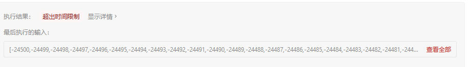
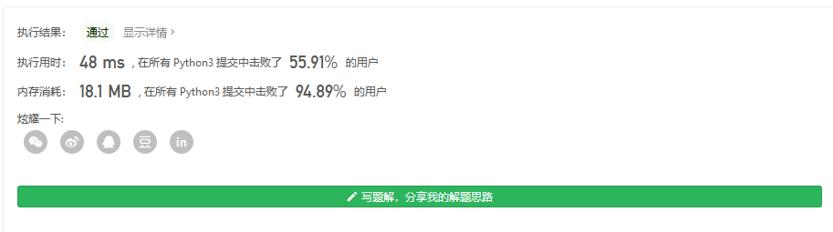
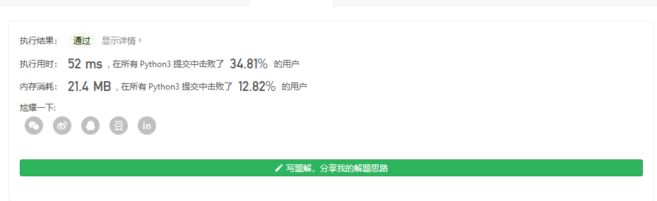

#### [217. Contains Duplicate](https://leetcode-cn.com/problems/contains-duplicate/)

Given an integer array `nums`, return `true` if any value appears **at least twice** in the array, and return `false` if every element is distinct.

 

**Example 1:**

```
Input: nums = [1,2,3,1]
Output: true
```

**Example 2:**

```
Input: nums = [1,2,3,4]
Output: false
```

**Example 3:**

```
Input: nums = [1,1,1,3,3,4,3,2,4,2]
Output: true
```

 

**Constraints:**

- `1 <= nums.length <= 105`
- `-109 <= nums[i] <= 109`


暴力搜索一下

```
class Solution:
    def containsDuplicate(self, nums:list) -> bool:
        for num in nums:
            if nums.count(num)>=2:
                return True
        return False
```

AC 不了



这时候要考虑怎么优化了

O(n²) 不行的话那就要想办法降到 nlogn 或者更低?

注意到每一次查找重复元素时,都有一个比较致命的缺点,就是会存在重复步骤

我们尝试一下原地修改数组,再用 O(n)的时间遍历

快速排序的平均复杂度为 nlogn 比 n² 好很多

```
class Solution:
    def containsDuplicate(self, nums:list) -> bool:
        if len(nums)<=1:
            return False
        nums.sort()
        t=nums[0]
        for ele in nums[1:]:
            if t==ele:
                return True
            t=ele
        return False
```



当然统计重复的 还是用哈希表舒服 ,O(n) + O(n)

```
class Solution:
    def containsDuplicate(self, nums:list) -> bool:
        if len(nums)<=1:
            return False
        d={}
        for ele in nums:
            if ele not in d:
                d[ele]=1
            else:
                return True
        return False
```

