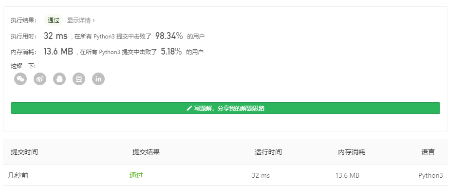

# [67. 二进制求和](https://leetcode-cn.com/problems/add-binary/)

难度简单503收藏分享切换为英文接收动态反馈

给你两个二进制字符串，返回它们的和（用二进制表示）。

输入为 **非空** 字符串且只包含数字 `1` 和 `0`。

**示例 1:**

```
输入: a = "11", b = "1"
输出: "100"
```

**示例 2:**

```
输入: a = "1010", b = "1011"
输出: "10101"
```

 

**提示：**

- 每个字符串仅由字符 `'0'` 或 `'1'` 组成。
- `1 <= a.length, b.length <= 10^4`
- 字符串如果不是 `"0"` ，就都不含前导零。

## 个人见解

### python

容易有，转化为整数再转化回去

**1分钟就写好了**

python已经有内置的方法了

```python
class Solution:
    def addBinary(self, a: str, b: str) -> str:
        return bin(int(a,2)+int(b,2))[2:]
```



