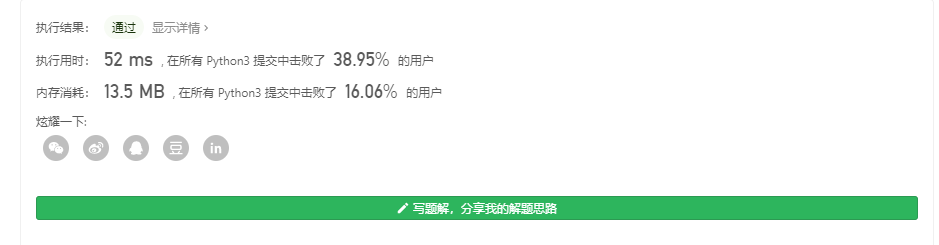

# [38. 外观数列](https://leetcode-cn.com/problems/count-and-say/)
给定一个正整数 n（1 ≤ n ≤ 30），输出外观数列的第 n 项。

注意：整数序列中的每一项将表示为一个字符串。

「外观数列」是一个整数序列，从数字 1 开始，序列中的每一项都是对前一项的描述。前五项如下：

1.     1
2.     11
3.     21
4.     1211
5.     111221
第一项是数字 1

描述前一项，这个数是 1 即 “一个 1 ”，记作 11

描述前一项，这个数是 11 即 “两个 1 ” ，记作 21

描述前一项，这个数是 21 即 “一个 2 一个 1 ” ，记作 1211

描述前一项，这个数是 1211 即 “一个 1 一个 2 两个 1 ” ，记作 111221

 

示例 1:
```
输入: 1
输出: "1"
```
_解释：这是一个基本样例。_

示例 2:
```
输入: 4
输出: "1211"
```
_解释：当 n = 3 时，序列是 "21"，其中我们有 "2" 和 "1" 两组，"2" 可以读作 "12"，也就是出现频次 = 1 而 值 = 2；_

类似 "1" 可以读作 "11"。所以答案是 "12" 和 "11" 组合在一起，也就是 "1211"。

通过次数138,491提交次数244,503

## 个人思路
### python
*这题就比较有意思了,竟然没有马上想到怎么做？？*  
不过观察规律就可以得到,很明显是一个迭代的过程(考虑递归)  
在想了一会后，很容易有思路，例如每一个数列都是由以下规律组成  
```
1 #leng=1 target='1' 即 str(leng)+target='11'
11 #接着这里就是  leng=2 target='1' 即 str(leng)+target='21'
21 # leng1=1 target1='2' leng2=1 target2='1'  即 str(leng)+target='1211'
1211 ... 
111221# ...
```

同理可以写出
```
class Solution:
    def countAndSay(self, n: int) -> str:
        string='1'

        for _ in range(n-1):
            leng = 0
            target = string[0]
            say = ''
            for i in range(len(string)):
                if(string[i]==target):
                    leng+=1
                if(i<len(string)-1):
                    if(string[i+1]!=target):
                        say+=str(leng)+target
                        target = string[i+1]
                        leng=0
            say+=str(leng)+target
            string=say
        return string
    
```

思路也是很简单的，开始统计string[0]代表的target，只要碰到不一样的数字，先放入len(target)+target的组合就行

但注意的是，直到最后的例如1211的11是没有改变数字的，所以最后还要再用一次这个组合加进去..


那么肯定存在递归写法，那么思考了一会后，就有这样的情况

我记得for循环一般情况下都能转化成递归形式的，即通过一个if来代替了for循环中的判断，然后调用自身即可

```
class Solution:
    def countAndSay(self, n: int) -> str:
        string='1'
        return self.description(string,n)
    def description(self,string,n):
        if (n>0):
            leng = 0
            target = string[0]
            say = ''
            for i in string:
                if (i == target):
                    leng += 1
                else:
                    say += str(leng) + target

                    target = i
            say += str(leng) + target
            string=say
            n -= 1
            return self.description(string,n)
        else:
            return string
```
可以看到递归蛮慢的，不过应该是我优化的问题哈哈
