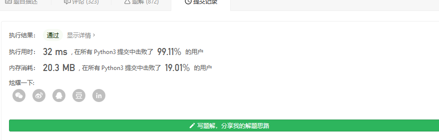

#### [剑指 Offer 17. 打印从1到最大的n位数](https://leetcode-cn.com/problems/da-yin-cong-1dao-zui-da-de-nwei-shu-lcof/)

输入数字 `n`，按顺序打印出从 1 到最大的 n 位十进制数。比如输入 3，则打印出 1、2、3 一直到最大的 3 位数 999。

**示例 1:**

```
输入: n = 1
输出: [1,2,3,4,5,6,7,8,9]
```

 

说明：

- 用返回一个整数列表来代替打印
- n 为正整数

这道题看上去挺简单的

```
class Solution:
    def printNumbers(self, n: int) -> list[int]:
        count=10**n
        return [i for i in range(1,count)]
```



但在c/c++ 里 考虑的都是大数问题

例如怎么把一个整数转化成字符串表示

怎么判断是否进位 怎么停止等 

先略过了