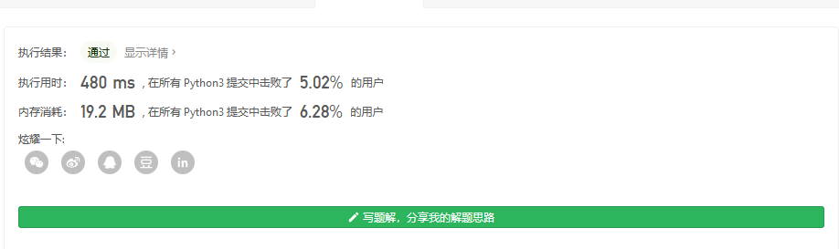
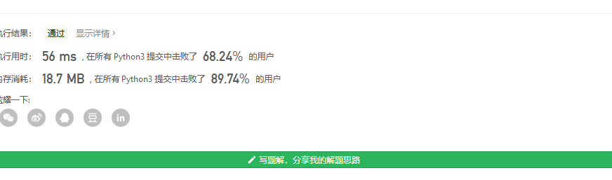

#### [剑指 Offer 21. 调整数组顺序使奇数位于偶数前面](https://leetcode-cn.com/problems/diao-zheng-shu-zu-shun-xu-shi-qi-shu-wei-yu-ou-shu-qian-mian-lcof/)

输入一个整数数组，实现一个函数来调整该数组中数字的顺序，使得所有奇数位于数组的前半部分，所有偶数位于数组的后半部分。

 

**示例：**

```
输入：nums = [1,2,3,4]
输出：[1,3,2,4] 
注：[3,1,2,4] 也是正确的答案之一。
```

 

**提示：**

1. `0 <= nums.length <= 50000`
2. `1 <= nums[i] <= 10000`

这题的话 至少可以看到有 O(n²)的方法

类似的是直接插入

```
class Solution:
    def exchange(self,nums) :
        l=[]
        for i in range(len(nums)):
            num=nums[i]
            if nums[i]%2==1:
                l.insert(0,num)
            else:
                l.insert(len(l),num)
        return l
```

这种效率很低咯



那么 更好的方法是

双指针

```
class Solution:
    def exchange(self,nums) :
        if not nums:
            return []
        i,j=0,len(nums)-1

        while i!=j:
            #从右边开始找起,直到找到一个奇数
            while j>0 and nums[j]%2==0  :
                j-=1
            #从左边开始找齐,直到偶数 或者到尽头
            while i<len(nums) and nums[i]%2==1  :
                i+=1
            if i>j:
                break
            nums[i],nums[j]=nums[j],nums[i]
        return nums
```

值得一提的是 判断奇偶数可以用位操作

```
class Solution:
    def exchange(self,nums) :
        if not nums:
            return []
        i,j=0,len(nums)-1

        while i!=j:
            #从右边开始找起,直到找到一个奇数
            while j>0 and nums[j]&0x1==0  :
                j-=1
            #从左边开始找齐,直到偶数 或者到尽头
            while i<len(nums) and nums[i]&0x1!=0  :
                i+=1
            if i>j:
                break
            nums[i],nums[j]=nums[j],nums[i]
        return nums
```

