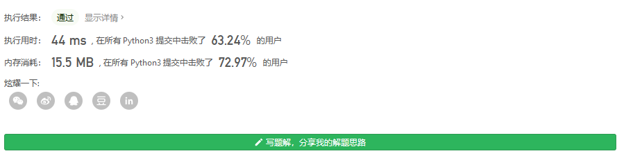

#### [剑指 Offer 24. 反转链表](https://leetcode-cn.com/problems/fan-zhuan-lian-biao-lcof/)

定义一个函数，输入一个链表的头节点，反转该链表并输出反转后链表的头节点。

 

**示例:**

```
输入: 1->2->3->4->5->NULL
输出: 5->4->3->2->1->NULL
```

 

**限制：**

```
0 <= 节点个数 <= 5000
```

 

基本功 很多方法



```
# Definition for singly-linked list.
from copy import deepcopy


class ListNode:
    def __init__(self, x):
        self.val = x
        self.next = None
    def __str__(self):
        return str(self.val)
class Solution:
    def reverseList(self, head: ListNode) -> ListNode:
        if head==None:
            return None
        cur=head.next
        head.next=None
        while cur:
            temp=cur.next
            cur.next=head
            head = cur
            cur=temp
        return head

l=ListNode(2)
l.next=ListNode(3)
l.next.next=ListNode(4)
Solution().reverseList(l)
```

鬼知道为什么我花了这么久

