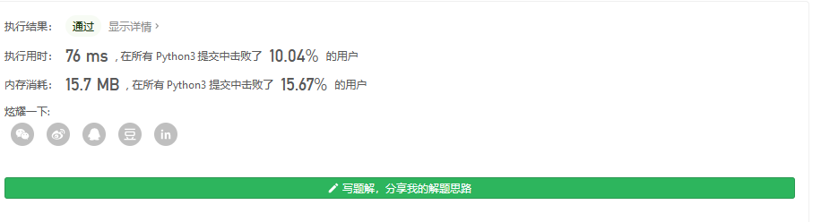
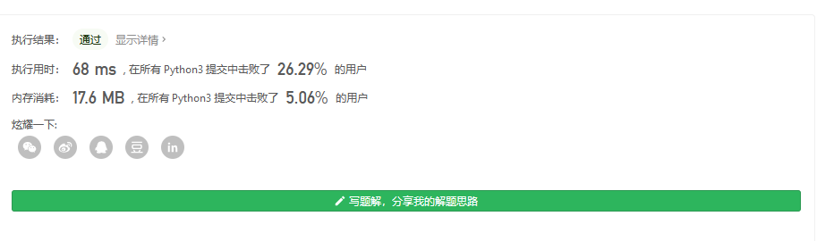

#### [剑指 Offer 25. 合并两个排序的链表](https://leetcode-cn.com/problems/he-bing-liang-ge-pai-xu-de-lian-biao-lcof/)

输入两个递增排序的链表，合并这两个链表并使新链表中的节点仍然是递增排序的。

**示例1：**

```
输入：1->2->4, 1->3->4
输出：1->1->2->3->4->4
```

**限制：**

```
0 <= 链表长度 <= 1000
```

注意：本题与主站 21 题相同：https://leetcode-cn.com/problems/merge-two-sorted-lists/

很清楚的知道 输入检测先


然后就是考虑怎么合并了,由于需要 仍然递增 所以 我们逐个判断 相当于新链表插入两个排序的链表

```
# Definition for singly-linked list.
class ListNode:
    def __init__(self, x):
        self.val = x
        self.next = None
    def __str__(self):
        return str(self.val)
class Solution:
    def mergeTwoLists(self, l1: ListNode, l2: ListNode) -> ListNode:
        if l1==None:
            return l2
        elif l2==None:
            return l1
        l3=ListNode(0)
        head=l3

        # 一直循环直到 l1 或 l2 空了
        while 1:
            if l1 and l2:
                if l1.val>l2.val:
                    l3.next=ListNode(l2.val)
                    l2=l2.next
                else:
                    l3.next=ListNode(l1.val)
                    l1=l1.next
                l3=l3.next
            elif l1:
                l3.next=ListNode(l1.val)
                l1=l1.next
                l3=l3.next
            elif l2:
                l3.next=ListNode(l2.val)
                l2=l2.next
                l3=l3.next
                pass
            else:
                break
        # while head:
        #     print(head.val)
        #     head=head.next
        return head.next


l1=ListNode(5)

l2=ListNode(1)
l2.next=ListNode(2)

l2.next.next=ListNode(3)
l2.next.next.next=ListNode(7)
Solution().mergeTwoLists(l1,l2)
```



当然,基于循环的很慢的,可以改成递归形式

```
class Solution:
    def mergeTwoLists(self, l1: ListNode, l2: ListNode) -> ListNode:
        def dfs(l1,l2):
            if l1==None:
                return l2
            elif l2==None:
                return l1
            mergedHead=ListNode(0)
            if(l1.val<l2.val):
                mergedHead=l1
                mergedHead.next=dfs(l1.next,l2)
            else:
                mergedHead=l2
                mergedHead.next=dfs(l1,l2.next)
            return mergedHead
        return dfs(l1,l2)
```



当然更好的解法是

```
class Solution:
    def mergeTwoLists(self, l1: ListNode, l2: ListNode) -> ListNode:
        dummy = ListNode(0)
        cur = dummy
        while l1 and l2:
            if l1.val <= l2.val:
                cur.next = l1
                l1 = l1.next
            else:
                cur.next = l2
                l2 = l2.next
            cur = cur.next

        cur.next = l1 if l1 else l2
        return dummy.next


作者：edelweisskoko
链接：https://leetcode-cn.com/problems/he-bing-liang-ge-pai-xu-de-lian-biao-lcof/solution/jian-zhi-offer-25-he-bing-liang-ge-pai-x-b8g0/
来源：力扣（LeetCode）
著作权归作者所有。商业转载请联系作者获得授权，非商业转载请注明出处。
```

