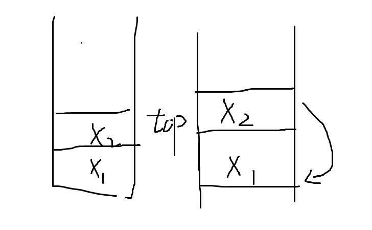
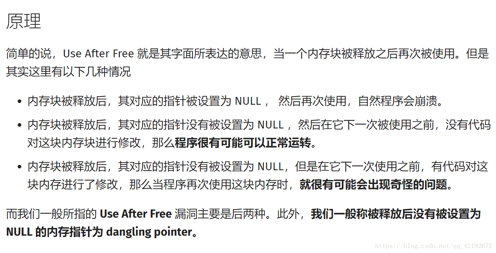

# [225. 用队列实现栈](https://leetcode-cn.com/problems/implement-stack-using-queues)
## 起因
看到[@喜王](https://github.com/XvX-sortie)在看java的队列操作，就想叫他一起做做这题。希望他会看到
## 题目
使用队列实现栈的下列操作：
```
push(x) -- 元素 x 入栈
pop() -- 移除栈顶元素
top() -- 获取栈顶元素
empty() -- 返回栈是否为空
```
注意:

你只能使用队列的基本操作--   
也就是   
```
push to back,   
peek/pop from front,   
size, 和  is empty 这些操作是合法的。
```
你所使用的语言也许不支持队列。 你可以使用 list 或者 deque（双端队列）来模拟一个队列 , 只要是标准的队列操作即可。

你可以假设所有操作都是有效的（例如, 对一个空的栈不会调用 pop 或者 top 操作）。

通过次数76,531提交次数116,418

## 个人见解
这道题，比较难，我一开始连题目在说什么都不知道，甚至我代码半天都敲不出什么，最后写了一个简单的栈，发现并不是这么简单..

我发现了，如果直接在脑海里过思路是蛮难实现代码的，我很惭愧我没有这种能力，所以还是拿草稿纸试了一下  
思路也很容易，就是构建一个列表，用尾插法来实现一个简单的链表，使用尾插法的原因是可以方便像栈一样拿到最外面(头指针)的那个元素   
大概思路如图
  
左边是stack，右边是一个列表  

## 但是
反反复复做都不对，一直给我报错
她说在下面这个过程中，出现了堆栈的非法访问  
```
["MyStack","push","push","top","pop","empty"]
[[],[1],[2],[],[],[]]
```
```
AddressSanitizer: heap-use-after-free on address 0x602000000210 at pc 0x55e23ae8f603 bp 0x7ffc38561ec0 sp 0x7ffc38561eb0
```
老子寻思着，在初始化,push,top,pop里，我一个字母一个字母扣，还是没用，还是一样..  
查了很多资料，看到这个图
  
跟我想的意思差不多，可问题是我没有访问啊。。一直找不到问题在哪..  
直到我去看了标准答案后，发现问题是.出现在别的函数里??  
你说在["MyStack","push","push","top","pop","empty"]函数里，结果我这里是我的
```
// void myStackFree(MyStack *obj)
// {
//     myNode *node = obj->top;
//     while (node != NULL)
//     {
//         free(node);
//         node = obj->top->next;
//     }
//     free(obj);
// }
```
上面这里问题也蛮明显的，我试图使用一个free了的变量再赋值，本来我以为free的只是node指向的空间的，没想到..我的问题  

__但是出了问题，我真服了，这难道就是声东击西?指桑骂槐的说我代码垃圾，我服了__  

## _我上面这个错误就错了，麻烦你指出来啊LeetCode给我摆了一道_  

将函数修成这样就过了，只要分别释放就好  

```
void myStackFree(MyStack *obj)
{
    myNode *node = NULL;
    while (node != NULL)
    {
        node = obj->top;
        free(node);
        node = obj->top->next;
    }
    free(obj);
}
```
最后的代码是
```
#include <stdio.h>
#include <stdlib.h>
typedef int bool;
typedef struct MyNode
{
    struct MyNode *next;
    int data;
} myNode;

typedef struct
{
    myNode *top;
} MyStack;

/** Initialize your data structure here. */

MyStack *myStackCreate()
{
    MyStack *stack = calloc(1, sizeof(MyStack));
    //stack->top = NULL;
    // calloc可以初始化置数
    return stack;
}

/** Push element x onto stack. */
void myStackPush(MyStack *obj, int x)
{
    myNode *q = (myNode *)malloc(sizeof(myNode));
    q->data = x;
    q->next = obj->top;

    obj->top = q;
}

/** Removes the element on top of the stack and returns that element. */
int myStackPop(MyStack *obj)
{
    myNode *topNode = obj->top;
    int data = topNode->data;
    obj->top = topNode->next;
    free(topNode);
    return data;
}

/** Get the top element. */
int myStackTop(MyStack *obj)
{
    return obj->top->data;
}

/** Returns whether the stack is empty. */
bool myStackEmpty(MyStack *obj)
{
    return (obj->top == NULL);
}

void myStackFree(MyStack *obj)
{
    myNode *node = NULL;
    while (node != NULL)
    {
        node = obj->top;
        free(node);
        node = obj->top->next;
    }
    free(obj);
}
void printStack(MyStack *obj)
{
    int data;
    printf("pop...\n");
    while (obj->top != NULL)
    {
        data = myStackPop(obj);
        printf("data=%d\n", data);
    }
}
/**
 * Your MyStack struct will be instantiated and called as such:
 * MyStack* obj = myStackCreate();
 * myStackPush(obj, x);
 
 * int param_2 = myStackPop(obj);
 
 * int param_3 = myStackTop(obj);
 
 * bool param_4 = myStackEmpty(obj);
 
 * myStackFree(obj);
*/
int main()
{
    MyStack *obj = myStackCreate();
    myStackPush(obj, 1);
    myStackPush(obj, 2);
    printf(" myStackTop(obj);=%d\n", myStackTop(obj));
    printf("myStackPop(obj);=%d\n", myStackPop(obj));
    myStackEmpty(obj);
}
```