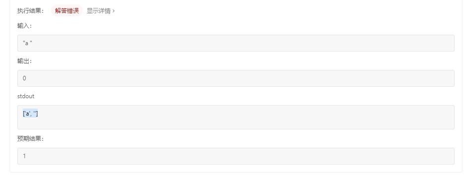
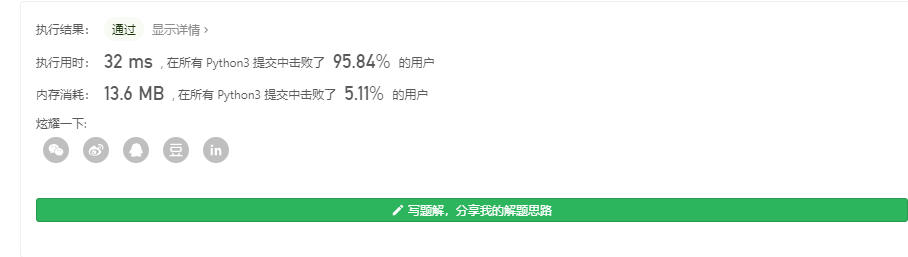
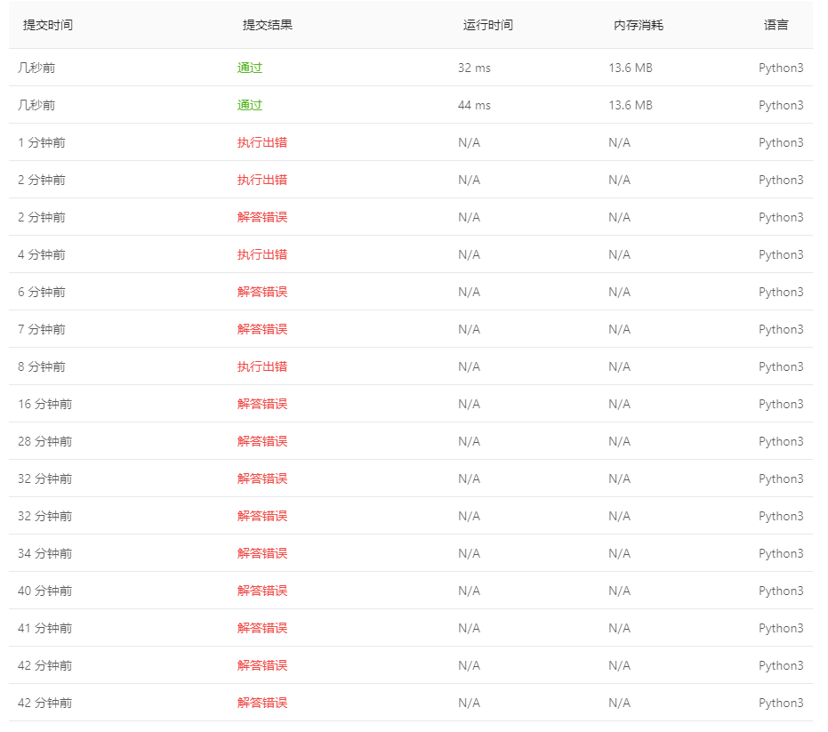

# [58. 最后一个单词的长度](https://leetcode-cn.com/problems/length-of-last-word/)

给定一个仅包含大小写字母和空格 `' '` 的字符串 `s`，返回其最后一个单词的长度。如果字符串从左向右滚动显示，那么最后一个单词就是最后出现的单词。

如果不存在最后一个单词，请返回 0 。

**说明：**一个单词是指仅由字母组成、不包含任何空格字符的 **最大子字符串**。

**示例:**

```
输入: "Hello World"
输出: 5
```

通过次数133,983提交次数

## 个人见解

### python

当我提交时，出现了这么一种奇怪的情况，这可能是本地python的版本中split和官方给的版本不一样

当我输入如下代码时

```python
class Solution:
    def lengthOfLastWord(self, s: str) -> int:
        print(s.split(' '))
        return len(s.split(' ')[-1])

s=Solution()
print(s.lengthOfLastWord("a"))
```

当我在LeetCode输入相同的代码时，出现




意思就是说，这个split的实现不一样，在split一个空格`' '`时，他的split返回了一个空的字符

`''`

我们要去除，最后看起来像这样

```python
class Solution:
    def lengthOfLastWord(self, s: str) -> int:
        # 拿split分割
        arrSplited=s.split(' ')
        #若出现 '' 说明有人搞你，乱搞空格,全部去掉，再看看有木有单词
        while( '' in arrSplited):
            arrSplited.remove('')
        if(not arrSplited):#去掉之后都是空的，那肯定是因为直接输入一堆空格了，就是在搞你
            return 0
        #都来到这里了，肯定有个单词在的了
        leng=len(arrSplited[-1])
        return leng

s=Solution()
print(s.lengthOfLastWord("        "))
```



