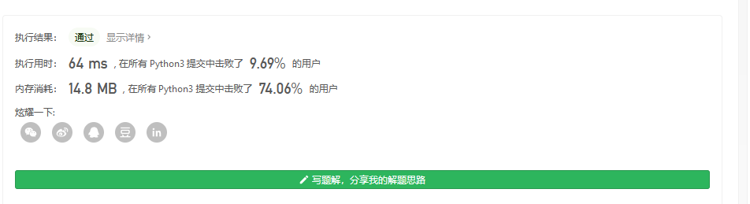

#### [剑指 Offer 22. 链表中倒数第k个节点](https://leetcode-cn.com/problems/lian-biao-zhong-dao-shu-di-kge-jie-dian-lcof/)

输入一个链表，输出该链表中倒数第k个节点。为了符合大多数人的习惯，本题从1开始计数，即链表的尾节点是倒数第1个节点。

例如，一个链表有 `6` 个节点，从头节点开始，它们的值依次是 `1、2、3、4、5、6`。这个链表的倒数第 `3` 个节点是值为 `4` 的节点。

 

**示例：**

```
给定一个链表: 1->2->3->4->5, 和 k = 2.

返回链表 4->5.
```

这道题也是挺简单的

先从简单的思路做起

即遍历一遍再遍历k次

```
from copy import  deepcopy

class Solution:
    def getKthFromEnd(self, head: ListNode, k: int) -> ListNode:
        if head==None:
            return None
        count=0
        temp=deepcopy(head)
        kNode=head
        while temp:
            count+=1
            temp=temp.next

        for i in range(count-k):
            kNode=kNode.next
        return kNode
```

注意python里深浅拷贝



当然很慢

所以我们想办法 

```
# Definition for singly-linked list.
from copy import  deepcopy


class ListNode:
    def __init__(self, x):
        self.val = x
        self.next = None

class Solution:
    def getKthFromEnd(self, head: ListNode, k: int) -> ListNode:
        if head==None:
            return None
        temp=deepcopy(head)
        #先走k次
        for i in range(k):
            temp=temp.next
        # 然后大家一起走
        while temp:
            head=head.next
            temp=temp.next
        return head
```


即使用了方法还是很慢,为啥呢?

