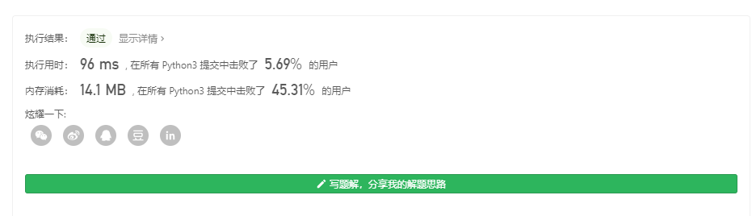
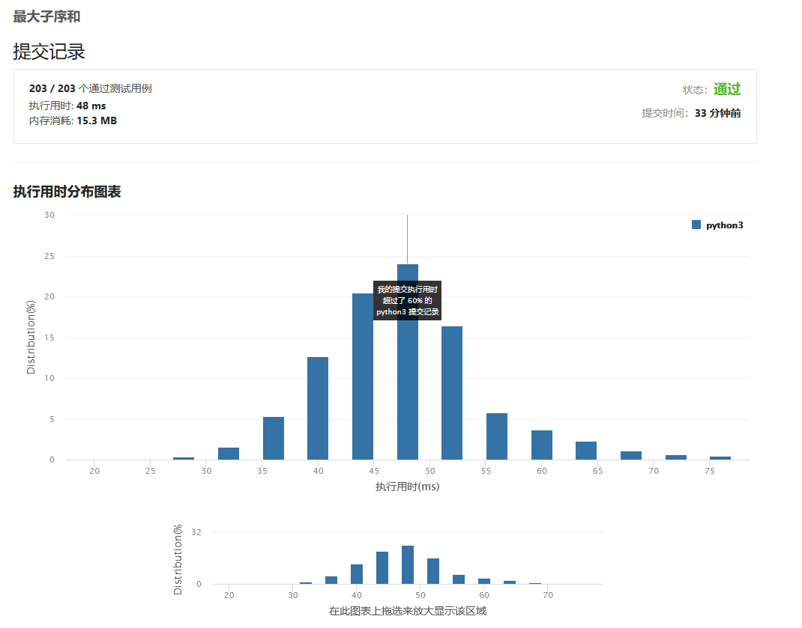

# [53. 最大子序和](https://leetcode-cn.com/problems/maximum-subarray/)

给定一个整数数组 nums ，找到一个具有最大和的连续子数组（子数组最少包含一个元素），返回其最大和。

Example 1:

```
Input: nums = [-2,1,-3,4,-1,2,1,-5,4]
Output: 6
Explanation: [4,-1,2,1] has the largest sum = 6.
```
Example 2:

```
Input: nums = [1]
Output: 1
```
Example 3:

```
Input: nums = [0]
Output: 0
```
Example 4:

```
Input: nums = [-1]
Output: -1
```
Example 5:

```
Input: nums = [-2147483647]
Output: -2147483647
```

进阶:

如果你已经实现复杂度为 O(n) 的解法，尝试使用更为精妙的分治法求解。

Constraints:
```
1 <= nums.length <= 2 * 104
-231 <= nums[i] <= 231 - 1
```
通过次数351,317提交次数667,718

## python

这道题很明显，第一个思路也只能是滑动窗口暴力遍历，除此之外就很离谱，还要我用O(n)的复杂度,我怎么觉得我的思路就是O(n2)

### 学到现在了，是不愿意直接用暴力法的，一定要摒弃这种思想！！

## 但是..
# 看到这题难度为简单，我陷入了沉思! 
# 思考了30分钟我一行代码没写出来，我又陷入了沉思

# 看了参考答案后，终于明白了许多，我又陷入了沉思

#### 方法1

穷举法的复杂度是O(n3)，根本不可能可以做得出来的，唉！

得换个思路，注意到数组里有正有负，容易得出一个显而易见的条件，即加了某个数后，对目前的局部和是否有正贡献。

拿以下数组做例子

`[-2,1,-3,4,-1,2,1,-5,4]`

首先获取这些参数

```python
        tmp = nums[0] #临时变量存放局部和
        max_ = tmp #最后的最大和
        n = len(nums)
```

第一步:

`tmp=-2 max_=-2`

现在是这样的啊，我们知道了这个之后，总得向前移动吧，所以我们先遍历

```python
        tmp = nums[0]
        max_ = tmp
        n = len(nums)
        for i in range(1, n):
        	...
```

我们要知道，目前tmp指向了nums[0]，max也是nums[0]，所以必须要知道到底是什么条件才会让局部和被赋值。

*我们开始尝试将当前tmp与下一个接触一下，看看会有什么变化*

`tmp + nums[i]`

容易知道一个点就是，这个结果为

`tmp + nums[i] =-2 + 1 = -1`

容易知道， nums[0]+nums[1]竟然比nums[1]还小，那还要nums[0]干吗，直接丢掉。

所以我们下一步得写一个判断，看看这种情况是什么意思

```python
tmp = nums[i]
```

相信你也注意到了，当前的最大值已经比刚才的大了，我们还需要加入让max_赋值的语句。

那么问题来了，此时我们有以下4种情况

1. 原先的max_ 在这里等于-2 (长度=1的子序列和)
2. 目前的tmp 在这里等于-2 (长度=1的子序列和)
3. 原先的max_+目前的tmp=-1 (长度=2的子序列和)
4. nums[1] = 1 (长度=1的子序列和)

他们的样子类似这样`-2,1,-2+1,-2`

这4种情况都要列出来，然后取最大值赋值,即

```python
        for i in range(1, n):
            if tmp + nums[i] > nums[i]:
				pass
            else:
                max_ = max(max_, tmp, tmp + nums[i], nums[i])
                tmp = nums[i]
```

那么，一个循环完成，我们接着看，现在的变量是

```python
tmp=1 max_=1
tmp + nums[i] =1 + -3 = -2
```

这里的`-1+-3=-2`的和比nums[i]代表的-3大，这意味着虽然这个-3是负作用，但是只要他们的和比它本身大就好了

*再怎么样都比一个数加了另一个数之后比另一个数还小好吧??*

 

基于此，就有了temp被赋值成-2，max_不变的原因,所以我们继续吧，终于遇到正数了

```python
tmp=-2 max_=1
tmp + nums[i] =-2 + 4 = 2
```

**理所应当的，这是4唉，是吊打我们前面所有的子序列和的，所以必须拿下**，直接赋值tmp和max_，继续

```
tmp=4 max_=4
tmp + nums[i] =4 + -1 = 3
```

```p
tmp=3 max_=4
tmp + nums[i] =3 + 2 = 5
tmp=5 max_=5
tmp + nums[i] =5 + 1 = 6
tmp=6 max_=6
tmp + nums[i] =6 + -5 = 1
tmp=1 max_=6
tmp + nums[i] =1 + 4 = 5
```

很明显，最后的赢家显然是max_=6

# 那么就是这种思路了~我得反思反思，为什么我想不出来aaa

[最后的代码是这个大佬给的](https://leetcode-cn.com/problems/maximum-subarray/solution/zui-da-zi-xu-he-cshi-xian-si-chong-jie-fa-bao-li-f/)

```python
class Solution:
    def maxSubArray(self, nums) -> int:
        tmp = nums[0]
        max_ = tmp
        n = len(nums)
        for i in range(1, n):
            print("tmp={} max_={}".format(tmp,max_))
            # 当当前序列加上此时的元素的值大于tmp的值，说明最大序列和可能出现在后续序列中，记录此时的最大值
            print("tmp + nums[i] ={} + {} = {}".format(tmp, nums[i], tmp + nums[i]))
            if tmp + nums[i] > nums[i]:

                max_ = max(max_, tmp + nums[i])
                tmp = tmp + nums[i]
            else:
                # 当tmp(当前和)小于下一个元素时，当前最长序列到此为止。以该元素为起点继续找最大子序列,
                # 并记录此时的最大值
                max_ = max(max_, tmp, tmp + nums[i], nums[i])
                tmp = nums[i]
        return max_

```




其实贪心算法也很有意思，可以去看看，在这里就不说了，因为我是想不出来的


2021年2月27日14:12:59 再做了一遍，有点思路了

```
class Solution:
    def maxSubArray(self, nums: List[int]) -> int:
        maxSum=nums[0]
        t=0
        for num in nums:
            t=max(num,num+t)
            maxSum=max(t,maxSum)

        return maxSum
```

