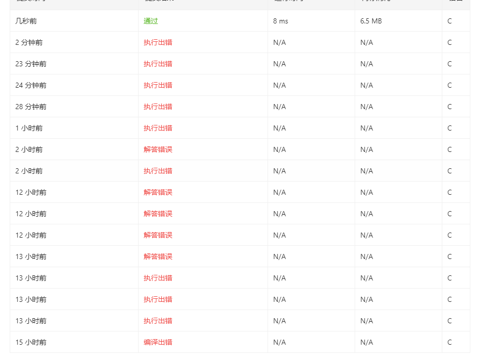

# [21. 合并两个有序链表](https://leetcode-cn.com/problems/merge-two-sorted-lists)

将两个升序链表合并为一个新的 升序 链表并返回。新链表是通过拼接给定的两个链表的所有节点组成的。 

 
示例：
```
输入：1->2->4, 1->3->4
输出：1->1->2->3->4->4
```

通过次数391,884提交次数607,231

## 个人见解
## 思路1：取出所有元素重排
痛苦，真的痛苦，我们首先来创建链表  
```
struct ListNode
{
    int val;
    struct ListNode *next;
    /* val */
} ListNode;
```
由于我一开始创建的链表的头结点是没有数据的，他这个偏偏要在头结点弄数据，真恶心啊都。。
```
struct ListNode *initList()
{
    struct ListNode *list = (struct ListNode *)malloc(sizeof(struct ListNode));
    list->next = NULL;
    return list;
}
```
```
void insertNode(struct ListNode *node, int x)
{
    //直接插到尾巴

    struct ListNode *tempNode = node;
    while (tempNode->next != NULL)
    {
        tempNode = tempNode->next;
    }
    struct ListNode *temp = (struct ListNode *)malloc(sizeof(struct ListNode));

    tempNode->val = x;
    tempNode->next = temp;
    temp->next = NULL;
    temp->val = 0;

    printf("insert .. %d \n", x);
}
```
因为这个机制，我还要把尾巴free了..
```
void freeLastOne(struct ListNode *node)
{

    struct ListNode *tempNode = node;
    if (tempNode == NULL)
    {
    }
    else
    {
        while (tempNode->next->next != NULL)
        {
            tempNode = tempNode->next;
        }
        tempNode->next = NULL;
        printf("free .. %d \n", tempNode->val);
        struct ListNode *t = tempNode->next;
        free(t);
    }
}
```
再用了一个动态数组存储数据后，再用直接插入排序排了一遍...
```

struct ListNode *mergeTwoLists(struct ListNode *l1, struct ListNode *l2)
{
    struct ListNode *out = initList();
    int var1 = -1, var2 = -1;
    struct ListNode *t1 = l1, *t2 = l2;
    int leng1 = 0, leng2 = 0;
    int i, j;
    while (t1 != NULL)
    {
        t1 = t1->next;
        leng1++;
    }
    while (t2 != NULL)
    {
        t2 = t2->next;
        leng2++;
    }
    if(leng2==0 && leng1==0){
        return NULL;
    }
    leng2--;
    leng1--;
    printf("leng1= %d  leng2= %d \n", leng1, leng2);

    int *arr1 = (int *)malloc((leng1 + leng2) * sizeof(int));

    int *arr2 = (int *)malloc(leng2 * sizeof(int));

    t1 = l1;
    t2 = l2;
    for (i = 0; i < leng1, t1 != NULL; i++)
    {
        arr1[i] = t1->val;
        t1 = t1->next;
    }
    for (i = 0; i < leng2, t2!= NULL; i++)
    {
        arr2[i] = t2->val;
        t2 = t2->next;
    }
    int curi = leng1;
    for (i = 0; i < leng2; i++)
    {
        // for (i = 0; i < curi; i++)
        // {
        //     printf("cur arr .. %d \n", arr1[i]);
        // }
        for (j = curi - 1; j >= 0; j--)
        {

            if (arr2[i] < arr1[j])
            {
                arr1[j + 1] = arr1[j];
            }
            else
            {
                // printf("break \n");
                break;
            }
        }
        arr1[j + 1] = arr2[i];
        curi++;
    }
    for (i = 0; i < leng2 + leng1; i++)
    {
        insertNode(out, arr1[i]);
        printf("arr .. %d \n", arr1[i]);
    }
    // freeLastOne(out);
    return out;
}
```
将排好的升序列表插入进新的链表就行..
```
    for (i = 0; i < leng2 + leng1; i++)
    {
        insertNode(out, arr1[i]);
        printf("arr .. %d \n", arr1[i]);
    }
```
在main函数为这样的
```
int main()
{
    struct ListNode *head1 = initList();
    insertNode(head1, 1);
    insertNode(head1, 2);
    insertNode(head1, 4);
    //freeLastOne(head1);
    //listPrint(head1);
    struct ListNode *head2 = initList();
    insertNode(head2, 1);
    insertNode(head2, 3);
    insertNode(head2, 4);
    //freeLastOne(head2);
    //listPrint(head2);
    struct ListNode *out = mergeTwoLists(head1, head2);
    listPrint(out);
    return 0;
}
```
```
insert .. 1 
insert .. 2
insert .. 4
insert .. 1
insert .. 3
insert .. 4
leng1= 3  leng2= 3
insert .. 1
arr .. 1
insert .. 1
arr .. 1
insert .. 2
arr .. 2
insert .. 3
arr .. 3
insert .. 4
arr .. 4
insert .. 4
arr .. 4
free .. 4
1->1->2->3->4->4->
```
情况下是没问题的，但是在那边会有问题，因为链表的设置不太一样..
改了一下就过了
官方的链表的方法和我的实现不一样，我的在本地跑是不会溢出的，到他那里就会overflow，真的草
```
AddressSanitizer: heap-buffer-overflow on address 0x602000000130 at pc 0x55a3c16bbbe6 bp 0x7ffe3c0257c0 sp 0x7ffe3c0257b0
```
出了溢出的错误，只能到处print大法,找到了错误..  是leng的问题，因为他那边的print跟我的不一样，所以额我把这个注释了就行了
```
    // leng2--;
    // leng1--;
```

嗯..


我发誓，这真的太恶心了,好在终于过了..  
其实花了蛮多时间调这个LeetCode报的bug，自己写出来的的bug其实还好..  
自己基础不扎实，也没办法，累了，休息去.  


提交的代码在[submission这](merge-two-sorted-lists-submission),至于另一个是用来本地测试的  

在做的过程中发现了很多可以优化的地方，可是真的累了.连这个md都不想写了  

给我最大的感受就是，真的太吃我时间了，而且我还没学到啥，就对数据结构熟悉了一点，我真服了，我智商怎么这么低。。  

## 思路2:动态元素插入

其实这个思路才是最简单的，只要遍历l2，查看元素，再跟l1的比较即可


然而我最讨厌的就是这种，本地跑的跟LeetCode跑的不一样的结果了，真的太恶心了！  
只能用print大法看看哪里断了。。

找到了

代码在[solution2](merge-two-sorted-lists-solution2)这里  

终于终于..
  
由于不依赖自己写的代码，所以简短了很多
```
struct ListNode *mergeTwoLists(struct ListNode *l1, struct ListNode *l2)
{
    int var1, var2;
    struct ListNode *t1 = l1, *t2 = l2, *head = l1;
    int count = 0;
    if (l1 == NULL && l2 == NULL)
    {
        return NULL;
    }

    if (l1 != NULL && l2 == NULL)
    {
        return t1;
    }
    else if (l2 != NULL && l1 == NULL)
    {
        return t2;
    }
    else
    {
        while (1)
        {

            if (t2 == NULL)
            {
                break;
            }
            listPrint(head);
            printf("t1.val =%d ", t1->val);
            var1 = t1->val;

            printf("t2.val =%d \n", t2->val);
            var2 = t2->val;

            struct ListNode *t = (struct ListNode *)malloc(sizeof(struct ListNode));
            t->next = NULL;
            t->val = var2;

            if (var2 >= var1)
            {
                printf("var2 > var1 \n");
                if (t1->next != NULL)
                {
                    if (t1->next->val > var2)
                    {
                        t->next = t1->next;
                        t1->next = t;
                        t2 = t2->next;
                    }
                }
                else
                {
                    t1->next = t;
                    t2 = t2->next;
                    t1 = head;
                    printf("restart \n");
                    continue;
                }
            }
            else
            {
                printf("var2 < var1 \n");
                if (t1 != NULL)
                {
                    //只有头指针跟t1指针相等才能头插，不然要connect
                    if (t1 == head)
                    {
                        printf("set head \n");
                        t->next = t1;
                        head = t;
                        t1 = head;
                        t2 = t2->next;
                        continue;
                    }
                    else{
                        printf("connect \n");

                    }

                    // printf("two num connect \n");
                    // t->next = t1->next;
                    // t1->next = t;
                }
                else //只有一个结点
                {
              
                }

                t2 = t2->next;
            }
            t1 = t1->next;

        }
    }
    return head;
}

```

[直到我看到了官方的递归解法，我已经湿了](https://leetcode-cn.com/problems/merge-two-sorted-lists/solution/he-bing-liang-ge-you-xu-lian-biao-by-leetcode-solu/)
````
class Solution {
public:
    ListNode* mergeTwoLists(ListNode* l1, ListNode* l2) {
        if (l1 == nullptr) {
            return l2;
        } else if (l2 == nullptr) {
            return l1;
        } else if (l1->val < l2->val) {
            l1->next = mergeTwoLists(l1->next, l2);
            return l1;
        } else {
            l2->next = mergeTwoLists(l1, l2->next);
            return l2;
        }
    }
};

作者：LeetCode-Solution
链接：https://leetcode-cn.com/problems/merge-two-sorted-lists/solution/he-bing-liang-ge-you-xu-lian-biao-by-leetcode-solu/
来源：力扣（LeetCode）
著作权归作者所有。商业转载请联系作者获得授权，非商业转载请注明出处。
```
真的太离谱