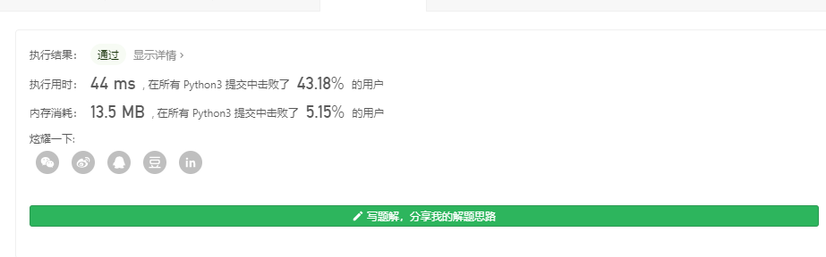

# [66. 加一](https://leetcode-cn.com/problems/plus-one/)

难度简单566收藏分享切换为英文接收动态反馈

给定一个由**整数**组成的**非空**数组所表示的非负整数，在该数的基础上加一。

最高位数字存放在数组的首位， 数组中每个元素只存储**单个**数字。

你可以假设除了整数 0 之外，这个整数不会以零开头。

**示例 1:**

```
输入: [1,2,3]
输出: [1,2,4]
解释: 输入数组表示数字 123。
```

**示例 2:**

```
输入: [4,3,2,1]
输出: [4,3,2,2]
解释: 输入数组表示数字 4321。
```

## 个人见解

直观的解法有，先把数组拿出来当成整数+1再丢入数组

### python 

```python
class Solution:
    def plusOne(self, digits):
        return list(eval(i) for i in str(eval(''.join([str(digit) for digit in digits]))+1))

s=Solution()
print(s.plusOne([4,3,2,2]))
```



 还有一种直观的方法，就是尾数+1，若是进位则全部加1，也很容易得出 

注意到如果99999+1一定会有100000，所以容易有

```python
class Solution:
    def plusOne(self, digits):
        length = len(digits)
        for i in range(length - 1, -1, -1):
            if digits[i] < 9:
                digits[i] += 1
                return digits
            digits[i] = 0
        return [1] + [0] * length
```


