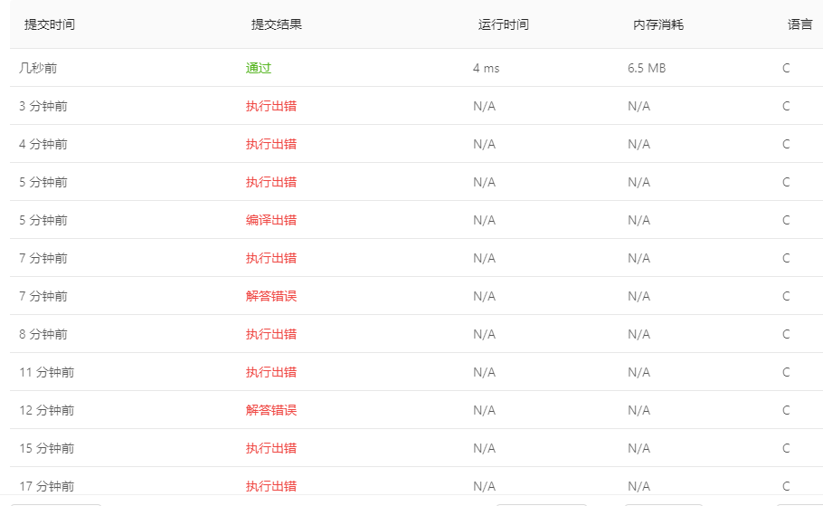

# [83. 删除排序链表中的重复元素](https://leetcode-cn.com/problems/remove-duplicates-from-sorted-list/)

给定一个排序链表，删除所有重复的元素，使得每个元素只出现一次。

**示例 1:**

```
输入: 1->1->2
输出: 1->2
```

**示例 2:**

```
输入: 1->1->2->3->3
输出: 1->2->3
```


## 个人见解

### C

这题还是C熟悉，python的链表没弄过，所以选择C了

这题很简单，基本就是数据结构课后习题的程度

```C
/**
 * Definition for singly-linked list.
 * struct ListNode {
 *     int val;
 *     struct ListNode *next;
 * };
 */
struct ListNode *deleteDuplicates(struct ListNode *head)
{
    if (head == NULL)
    {
        return head;
    }
    struct ListNode *pre = head;
    struct ListNode *cur = head;
    cur = cur->next;
    while (cur != NULL)
    {
		//可能存在多个相同的[1,1,1]
            while (cur!=NULL && cur->val == pre->val)
            {
                printf("cur.val=%d pre.val=%d \n", cur->val, pre->val);
                pre->next = cur->next;
                free(cur);
                cur = pre->next;
            }
     
        if (cur != NULL)
            cur = cur->next;
        pre = pre->next;
    }
    return head;
}
```

不过要小心的是这种情况，记得加

`if (cur != NULL)`

我是没用草稿纸脑子操作的，所以会出很多意外，就会像这样子，实在不推荐，只要拿草稿纸画一下理一理思路就行了

对于条件是`cur->next!=NULL`还是`cur!=NULL`因人而异，这里我使用了后者，然后就发现前者方便了哈哈哈



对于指针越界访问这些，都是正常现象，关键是要找出来到底是哪里得一个个排查，就很恶心啦

好在还不错这个结果

 