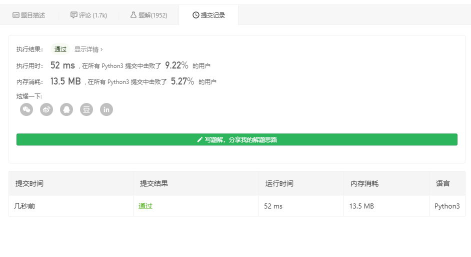

# 27. 移除元素
给你一个数组 nums 和一个值 val，你需要 原地 移除所有数值等于 val 的元素，并返回移除后数组的新长度。

不要使用额外的数组空间，你必须仅使用 O(1) 额外空间并 原地 修改输入数组。

元素的顺序可以改变。你不需要考虑数组中超出新长度后面的元素。

 

示例 1:
```
给定 nums = [3,2,2,3], val = 3,
```
函数应该返回新的长度 2, 并且 nums 中的前两个元素均为 2。

你不需要考虑数组中超出新长度后面的元素。
示例 2:
```
给定 nums = [0,1,2,2,3,0,4,2], val = 2,
```
函数应该返回新的长度 5, 并且 nums 中的前五个元素为 0, 1, 3, 0, 4。

注意这五个元素可为任意顺序。

你不需要考虑数组中超出新长度后面的元素。
 

说明:

为什么返回数值是整数，但输出的答案是数组呢?

请注意，输入数组是以「引用」方式传递的，这意味着在函数里修改输入数组对于调用者是可见的。

你可以想象内部操作如下:
```
// nums 是以“引用”方式传递的。也就是说，不对实参作任何拷贝
int len = removeElement(nums, val);

// 在函数里修改输入数组对于调用者是可见的。
// 根据你的函数返回的长度, 它会打印出数组中 该长度范围内 的所有元素。
for (int i = 0; i < len; i++) {
    print(nums[i]);
}
```

## 个人理解
这题简单的懒得说了，tm都能一次过了

```
class Solution:
    def removeElement(self, nums: list, val: int) -> int:
        while(val in nums):
            nums.remove(val);
        return len(nums)
s=Solution()
print(s.removeElement([0,1,2,2,3,0,4,2],2))
```
说到这，建议看看[https://www.cnblogs.com/lykkk/p/11448773.html](https://www.cnblogs.com/lykkk/p/11448773.html)

涉及到3种删除python列表元素的方法..  

但现在问题是，该怎么快速优化呢？  

要知道，删除是很浪费时间的，我们需要更好的处理的话，必须把传进来的val覆盖了(跟上一题这样做的原理差不多,虽然我还没写)

代码来自[https://leetcode-cn.com/problems/remove-element/solution/python-shuang-zhi-zhen-da-fa-hao-a-quan-guo-zui-ca/](https://leetcode-cn.com/problems/remove-element/solution/python-shuang-zhi-zhen-da-fa-hao-a-quan-guo-zui-ca/)
```
class Solution:
    def removeElement(self, nums: list, val: int) -> int:
        a = 0
        b = 0

        while a < len(nums):
            if nums[a] != val:
                nums[b] = nums[a]
                b += 1
            a += 1

        return b

```

