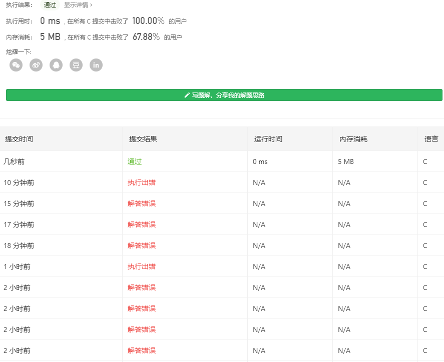

# [7. 整数反转](https://leetcode-cn.com/problems/reverse-integer/)
给出一个 32 位的有符号整数，你需要将这个整数中每位上的数字进行反转。

示例 1:
```
输入: 123
输出: 321
```
 示例 2:
```
输入: -123
```
输出: -321
示例 3:
```
输入: 120
输出: 21
```
注意:

__假设我们的环境只能存储得下 32 位的有符号整数，则其数值范围为 [−2^31,  2^31 − 1]。请根据这个假设，如果反转后整数溢出那么就返回 0。__

通过次数484,350提交次数1,396,049

## 个人解析
这种简单题都是第一眼就有直接思路的，例如这题  
只要变成字符串翻转再分类讨论即可  
### python
基于此，用python会快很多，因为很多方法都直接有现成的方法。  
注意上面这句话，要判断出整数溢出的情况，容易有
```
class Solution(object):
    def reverse(self, x):
        uplimit=2147483647 #2**31-1
        downlimit=-2147483648
        x=str(x)
        if (x[0] != '-'):
            x = x[::-1]
            if (int(x) <uplimit and int(x) >downlimit):
                return int(x)
            else:
                return 0
        else:
            x = x[1:][::-1]
            if (int(x) < uplimit and int(x)> downlimit):
                
                return int('-'+x)
            else:
                return 0
```
执行用时: 36 ms
内存消耗: 11.4 MB
### C
但实际上，用C写的话，我竟蒙在原地..  
如何获得int的所有位数并且转化为字符，思路都摆在这里了。
实际上是我对数字的不敏感，例如把x=1234中每一位数提取出来的话，先拿个位4那么就是  
```
1234%10=4
```
那么现在4已经取出来了，得想办法把他的个位去掉
```
1234/10=123
```
好，现在继续取余
```
123%10=3
```
```
123/10=12
```
..  
就可以分别取到1234了，现在把C代码写在这里
```
    for (i = 0; i < 10; i++)
    {

        arr[i] = x % 10;
        x /= 10;
        arrLeng++;
        
        if (x < 10)
        {
            arr[i + 1] = x % 10;
            arrLeng++;
            break;
        }
    }
```
而且刚好是倒序，那么就方便了，只要再分类讨论就好  
注意分别要是  正负，溢出overflow的判断最重要！
```
long pow_(int p, int n)
{
    if (p == 2 && n == 31)
    {
        return 2147483647;
    }
    int i;
    long result = 1;
    for (i = 0; i < n; i++)
    {
        result *= p;
    }
    return result;
}

int reverse(int x)
{
    int i, arrLeng = 0,signal=1;
    unsigned int r = 0;
    int arr[10];
    int MAX = pow_(2, 31), MIN = -pow_(2, 31) - 1;

    if(x<=MIN || x>MAX){
        return 0;
    }

    if (x < 0)
    {
        x *= -1;
        signal=-1;
    }

    if (x < 10 && x>=0)
    {
        return x > 0 ? x : -x;
    }
    for (i = 0; i < 10; i++)
    {

        arr[i] = x % 10;
        x /= 10;
        arrLeng++;
        
        if (x < 10)
        {
            arr[i + 1] = x % 10;
            arrLeng++;
            break;
        }
    }

    if (arr[0] > 2 && arrLeng == 10)
    {
        return 0;
    }
    else if (arr[0] == 2  && arrLeng == 10)
    {
        int t = MAX - 2000000000;
        for (i = 1; i < arrLeng; i++)
        {
            r += arr[i] * pow_(10, arrLeng - i - 1);
            if (t < r)
                return 0;
        }
        r+=2000000000;
        return signal > 0 ? r : -r;
    }
    for (i = 0; i < arrLeng; i++)
    {
        r += arr[i] * pow_(10, arrLeng - i - 1);
        
    }

    return signal > 0 ? r : -r;
}
```

以上的是呕心沥血两个小时终于写出来了，我是真的蠢到爆炸没有脸见人了,特别是，特别是判断overflow这里，磨了我1小时，真的无语..  
  

浪费了人生的两个小时就这?

不过  这是我目前自己写过的 执行用时最低的，哈哈哈，不知道能不能装逼  
不过这么多if是真的垃圾，我是真傻逼..  