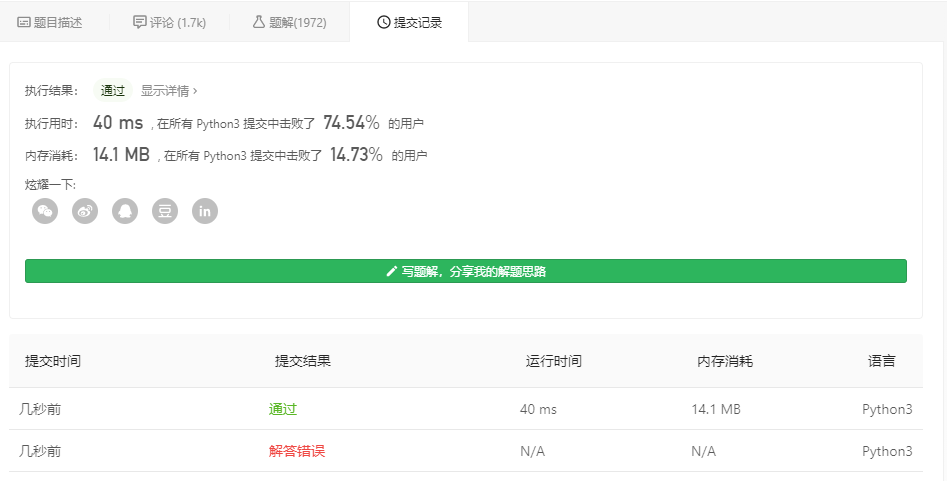
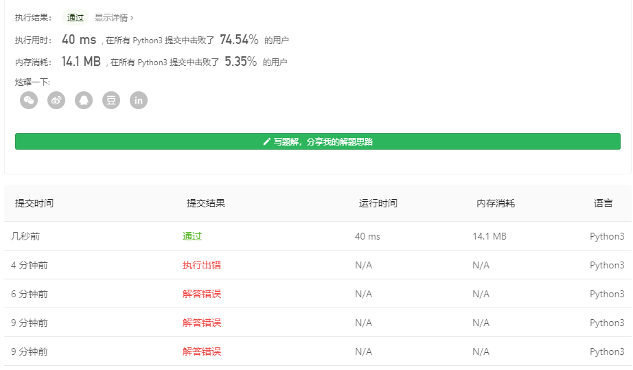

# [35. 搜索插入位置](https://leetcode-cn.com/problems/search-insert-position/)
给定一个排序数组和一个目标值，在数组中找到目标值，并返回其索引。如果目标值不存在于数组中，返回它将会被按顺序插入的位置。

你可以假设数组中无重复元素。

示例 1:
```
输入: [1,3,5,6], 5
输出: 2
```
示例 2:
```
输入: [1,3,5,6], 2
输出: 1
```
示例 3:
```
输入: [1,3,5,6], 7
输出: 4
```
示例 4:
```
输入: [1,3,5,6], 0
输出: 0
```
通过次数265,489提交次数568,175

## 个人理解
看上去，好像仅仅是一个直接插入排序的变形   
既然如此，那就再复习一遍[直接插入排序](../../Sort-Algorithm/Straight-Insertion-Sort)  

### py版本
自然而然的就有
```
class Solution:
    def searchInsert(self, nums: list, target: int) -> int:
        if target in nums:
            return nums.index(target)
        else:
            return self.Straight_InsertionArray(nums,[target])

    #直接插入一个无序数组到有序数组中
    def Straight_InsertionArray(self,nums,insert):
        for innum in insert:
            for numi in range(len(nums)-1,-1,-1):
                if(innum<nums[0]):
                    nums.insert(0,innum)
                    return 0

                if(innum>=nums[numi]):
                    nums.insert(numi+1,innum)
                    return  numi+1


```


其实还可以简化很多，因为这里用了一个sb的例子，用来插入返回了
```
class Solution:
    def searchInsert(self, nums: list, target: int) -> int:
        if target in nums:
            return nums.index(target)
        else:
            t=[i+1 for i in range(len(nums)-1,-1,-1) if target > nums[i]]
            if (t!=[]):
                return t[0]
            else:
                return 0
```
只要获得到target大于哪一个即可，如果没找到就是最小的，即在0处插入



### c版本
这题其实比上面实现python简单很多..只不过是复习了一下直接插入排序而已
```

int searchInsert(int *nums, int numsSize, int target)
{
    int i, j;
    
    for (i = numsSize-1; i >= 0; i--) //循环从第2个元素开始
    {
        if(target==nums[i]){
            return i;
        }
        if(target>nums[i]){
            return i+1;
        }
    }
    return 0;
}
```
只要这样就行了  

  

你敢信?