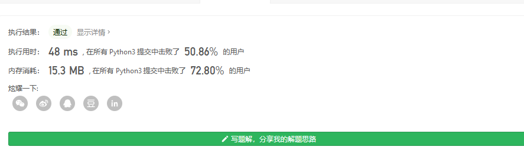

#### [剑指 Offer 18. 删除链表的节点](https://leetcode-cn.com/problems/shan-chu-lian-biao-de-jie-dian-lcof/)

给定单向链表的头指针和一个要删除的节点的值，定义一个函数删除该节点。

返回删除后的链表的头节点。

**注意：**此题对比原题有改动

**示例 1:**

```
输入: head = [4,5,1,9], val = 5
输出: [4,1,9]
解释: 给定你链表中值为 5 的第二个节点，那么在调用了你的函数之后，该链表应变为 4 -> 1 -> 9.
```

**示例 2:**

```
输入: head = [4,5,1,9], val = 1
输出: [4,5,9]
解释: 给定你链表中值为 1 的第三个节点，那么在调用了你的函数之后，该链表应变为 4 -> 5 -> 9.
```

 

**说明：**

- 题目保证链表中节点的值互不相同
- 若使用 C 或 C++ 语言，你不需要 `free` 或 `delete` 被删除的节点

这需要 输入检查了

如果是none 直接返回

没有指针无法做到像c语言那样 O(1) + O(n)的时间删除

所以只能常规做法了

```
class Solution:
    def deleteNode(self, head: ListNode, val: int) -> ListNode:
        if head==None:
            return None
        elif head.next==None:#如果只有头结点
            if head.val==val:
                return None
            return head
        tempHead= head
        # 如果删除的是头结点
        if tempHead.val==val:
            head=head.next
            return head
        while tempHead.next:
            if tempHead.next.val==val:
                tempHead.next=tempHead.next.next
                break
            tempHead=tempHead.next
        return head
```

