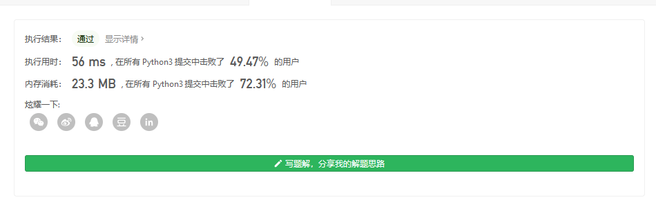

#### [剑指 Offer 03. 数组中重复的数字](https://leetcode-cn.com/problems/shu-zu-zhong-zhong-fu-de-shu-zi-lcof/)

找出数组中重复的数字。


 在一个长度为 n 的数组 nums 里的所有数字都在 0～n-1 的范围内。数组中某些数字是重复的，但不知道有几个数字重复了，也不知道每个数字重复了几次。请找出数组中任意一个重复的数字。

**示例 1：**

```
输入：
[2, 3, 1, 0, 2, 5, 3]
输出：2 或 3 
```

 

**限制：**

```
2 <= n <= 100000
```


由于输出的是任意一个重复的数字,那么也很容易的得到

直接根据之前的经验暴力一下

用nlogn的复杂度

```
class Solution:
    def findRepeatNumber(self, nums: list[int]) -> int:
        nums.sort()
        t=nums[0]
        for num in nums[1:]:
            if t==num:
                return t
            t=num
        
```



当然还有一个字典的辅助方法,就不说了,很简单

