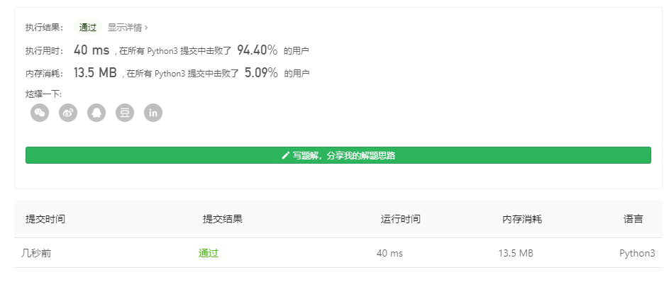
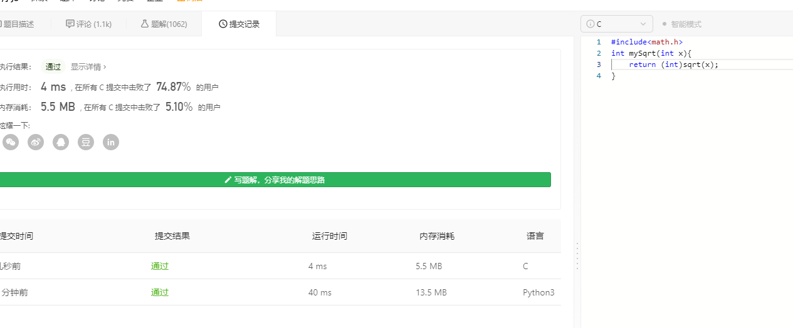

# [69. x 的平方根](https://leetcode-cn.com/problems/sqrtx/)

实现 `int sqrt(int x)` 函数。

计算并返回 *x* 的平方根，其中 *x* 是非负整数。

由于返回类型是整数，结果只保留整数的部分，小数部分将被舍去。

**示例 1:**

```
输入: 4
输出: 2
```

**示例 2:**

```
输入: 8
输出: 2
说明: 8 的平方根是 2.82842..., 
    由于返回类型是整数，小数部分将被舍去。
```

## 个人见解

这题有意思了

### python

当然，这作弊了笑死我

```
import math
class Solution:
    def mySqrt(self, x: int) -> int:
        return int(math.sqrt(x))
s=Solution()
print(s.mySqrt('11','11'))
```





C语言也学坏了

### 我们要正视一下，研究一下平方根到底是怎么工作的，别作弊啊我艹

