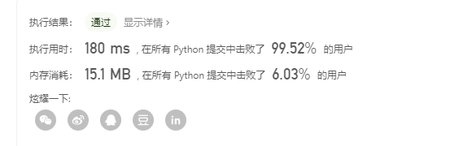
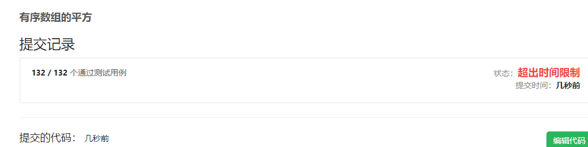
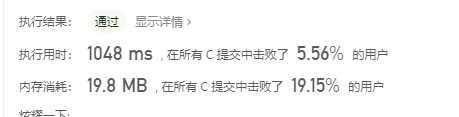

# [977. 有序数组的平方](https://leetcode-cn.com/problems/squares-of-a-sorted-array/)
给定一个按非递减顺序排序的整数数组 A，返回每个数字的平方组成的新数组，要求也按非递减顺序排序。
```
示例 1：

输入：[-4,-1,0,3,10]
输出：[0,1,9,16,100]
示例 2：

输入：[-7,-3,2,3,11]
输出：[4,9,9,49,121]
 
```
提示：
```
1 <= A.length <= 10000
-10000 <= A[i] <= 10000
A 已按非递减顺序排序。
通过次数66,737提交次数91,133
```

## 个人解析

说实话，这种题用python做是不用脑子就能弄出来..因为自带的方法太好用了，以及这个列表推导式都很棒
```
class Solution(object):
    def sortedSquares(self, A):
        """
        :type A: List[int]
        :rtype: List[int]
        """
        return sorted([i**2 for i in A])
s=Solution()
print(s.sortedSquares([-4,-1,0,3,10]))
```

这个压根没啥好说的，哈哈哈..换成C试一xia   
如果我们以最简单的方式，即用直观觉察到的for循环和冒泡排序的话，会写出这样
```
int *sortedSquares(int *A, int ASize, int *returnSize)
{
    int i, j, t, *returnArr;
    *returnSize=ASize;
    returnArr = (int *)malloc(ASize * sizeof(int));
    for (i = 0; i < ASize; i++)
    {
        *(returnArr + i) = A[i] * A[i];
    }
    for (i = 0; i < ASize - 1; i++)
    {
        for (j = 0; j < ASize - 1-i; j++)
        {

            if (returnArr[j] > returnArr[j + 1])
            {
                t = returnArr[j + 1];
                returnArr[j + 1] = returnArr[j];
                returnArr[j] = t;
            }
        }
    }
    return returnArr;
}
```
很明显，由于下面这个的存在，是不允许过的
```
1 <= A.length <= 10000
-10000 <= A[i] <= 10000
```
  
我们需要优化一下..   
__冒泡排序结束的条件是，在一趟排序中没有发生交换__根据这个原理容易得到升级版冒泡
```
    
    for (i = 0; i < ASize - 1; i++)
    {
        flag=0;
        for (j = 0; j < ASize - 1-i; j++)
        {

            if (returnArr[j] >= returnArr[j + 1])
            {
                t = returnArr[j + 1];
                returnArr[j + 1] = returnArr[j];
                returnArr[j] = t;
                flag=1;
            }
            if(flag==0){
                return returnArr;
            }

        }
    }
```
可是还是过不了，这该怎么办呢?这还是简单题吗呜呜呜  
我们只能想办法提升排序的效率了.   这题其实还是一道排序效率题罢了哈哈  

以下内容来自[https://leetcode-cn.com/problems/squares-of-a-sorted-array/solution/ge-chong-pai-xu-shuang-zhi-zhen-by-toxic-3/](https://leetcode-cn.com/problems/squares-of-a-sorted-array/solution/ge-chong-pai-xu-shuang-zhi-zhen-by-toxic-3/)

1、直接插入排序

```
int* sortedSquares(int* a, int n, int* returnSize){
	*returnSize=n;
	if(n==0) return a;
	a[0]=a[0]*a[0];
	int j;
	for(int i=1;i<n;i++){
		int temp=a[i]*a[i];
		for(j=i-1;j>=0;j--){
			if(temp<a[j]) a[j+1]=a[j];
			else break;
		}
		a[j+1]=temp;
	}
	return a;
}
```
2、折半插入排序
```

int* sortedSquares(int* a, int n, int* returnSize){
	*returnSize=n;
	if(n==0) return a;
	a[0]=a[0]*a[0];
	int j;
	for(int i=1;i<n;i++){
		int temp=a[i]*a[i];
		int low=0,high=i-1;
		while(low<=high){
			int mid=(low+high)/2;
			if(temp>a[mid]) low=mid+1;
			else high=mi-1;
		}
		for(j=i-1;j>high;j--){
			a[j+1]=a[j];
		}
		a[j+1]=temp;
	}
	return a;
}
```
3、选择排序
```

int* sortedSquares(int* a, int n, int* returnSize){
	*returnSize=n;
	if(n==0) return a;
	int k=0;
	for(int i=0;i<n;i++){
		a[k++]=a[i]*a[i];
	} 
	for(int i=0;i<n-1;i++){
		for(int j=i+1;j<n;j++){
			if(a[j]<a[i]){
				int temp=a[i];
				a[i]=a[j];
				a[j]=temp;
			}
		}
	}
	return a;
}
```
4、冒泡排序

```
int* sortedSquares(int* a, int n, int* returnSize){
	*returnSize=n;
	if(n==0) return a;
	int k=0;
	for(int i=0;i<n;i++){
		a[k++]=a[i]*a[i];
	} 
	for(int i=0;i<n;i++){
		for(int j=0;j<n-i-1;j++){
			if(a[j+1]<a[j]){
				int temp=a[j+1];
				a[j+1]=a[j];
				a[j]=temp;
			}
		}
	}
	return a;
}
```
5、带判断条件的冒泡排序

```
int* sortedSquares(int* a, int n, int* returnSize){
	*returnSize=n;
	if(n==0) return a;
	int k=0;
	for(int i=0;i<n;i++){
		a[k++]=a[i]*a[i];
	} 
	int flag=1;
	while(n>1&&flag==1){
		flag=0;
		for(int j=0;j<n-1;j++){
			if(a[j+1]<a[j]){
				flag=1;
				int temp=a[j+1];
				a[j+1]=a[j];
				a[j]=temp;
			}
		}
	}
	return a;
}
```
## 选择排序 和冒泡排序会时间超限
由于其他的排序我没接触过，当然都不知道是什么玩意哈哈,我们来看看直接插入排序.  
其实就是我们经常遇到的那种，将一个数根据大小插入而已，这里设计到一个for循环，用在这里可以少一个for循环  

由于数组一开始是空的，所以我们需要先插入第一个
```
    returnArr[0] = A[0] * A[0];
```
然后我们开始遍历要插入的数字
```
    for (i = 1; i < ASize; i++)
    {

        ...
    }
```
接着我们取要插入的数字
```
    for (i = 1; i < ASize; i++)
    {

        t = A[i] * A[i];
...
    }
```
接着我们就可以用一个for循环插入了，如果遇到比自己大的就停下，然后移动后面n+1个元素
```
    for (i = 1; i < ASize; i++)
    {

        t = A[i] * A[i];
        for (j =i-1; j >=0; j--)
        {
            if (t < returnArr[j])
            {
                returnArr[j+1] = returnArr[j];
            }
            else
                break;
        }
        returnArr[j+1] = t;
    }
```
直到空出来一个位置，就可以赋值了，还是比较好理解的。哈哈
  
所以当然效率也就仅此而已罢了..  
