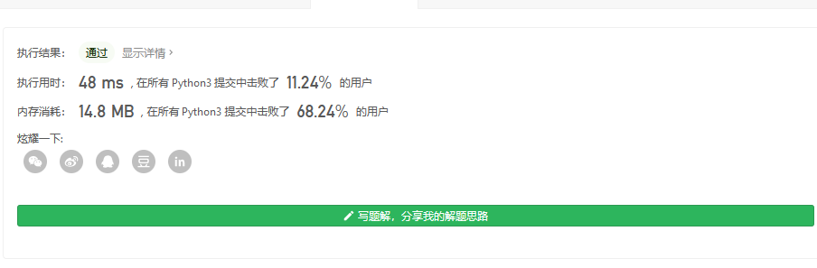

#### [剑指 Offer 05. 替换空格](https://leetcode-cn.com/problems/ti-huan-kong-ge-lcof/)

请实现一个函数，把字符串 `s` 中的每个空格替换成"%20"。

 

**示例 1：**

```
输入：s = "We are happy."
输出："We%20are%20happy."
```

 

**限制：**

```
0 <= s 的长度 <= 10000
```


在c语言里 用的是双指针的办法

从后往前替换 char的方法

但在python里


```
class Solution:
    def replaceSpace(self, s: str) -> str:
        return s.replace(' ','%20')
```



当然,重点不是这个 重点是我们要理解c语言指针的用法

```
char* replaceSpace(char* s){
    int count = 0, len = 0;
    for (int i = 0; i < strlen(s); i++) {
        len++;
        if (s[i] == ' ') {
            count++;
        }
    }
    s = (char*)realloc(s, sizeof(char) * (len  + 2 * count + 1));
    s[len + 2 * count] = '\0';
    int R = len + 2 * count - 1;
    for (int L = len - 1; L >= 0; L--) {
        if (s[L] != ' ') {
            s[R--] = s[L];
        } else {
            s[R--] = '0';
            s[R--] = '2';
            s[R--] = '%';
        }
    }
    return s;
}


作者：dyzahng
链接：https://leetcode-cn.com/problems/ti-huan-kong-ge-lcof/solution/jian-zhi-offer-05-ti-huan-kong-ge-by-dyz-dq0x/
来源：力扣（LeetCode）
著作权归作者所有。商业转载请联系作者获得授权，非商业转载请注明出处。
```

