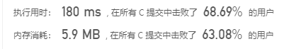
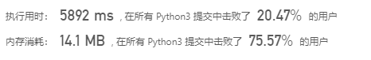

# [1. 两数之和](https://leetcode-cn.com/problems/two-sum)
给定一个整数数组 nums 和一个目标值 target，请你在该数组中找出和为目标值的那 两个 整数，并返回他们的数组下标。

你可以假设每种输入只会对应一个答案。但是，数组中同一个元素不能使用两遍。

 

示例:

给定 nums = [2, 7, 11, 15], target = 9

因为 nums[0] + nums[1] = 2 + 7 = 9  

所以返回 [0, 1]  

通过次数1,454,802提交次数2,929,448
## 个人解析
### C
这种简单题，一般会有一种直接的思路，例如两个for循环就能搞定的题,C代码如下
```
#include <stdio.h>
#include <stdlib.h>
/**
 * Note: The returned array must be malloced, assume caller calls free().
 */
int *twoSum(int *nums, int numsSize, int target, int *returnSize)
{
    int i, j,*returnArr;
    *returnSize=2;
    returnArr=(int *)malloc(sizeof(int)*2);
    for (i = 0; i < numsSize - 1; i++)
    {
        for (j = i+1; j < numsSize; j++)
        {
            if(nums[i]+nums[j]==target){
     
                *returnArr++=i;
                *returnArr--=j;
                return returnArr;
            }
        }
    }
    return NULL;
}
int main()
{
    int nums[]={2,7,11,15}, target=9, *returnSize,*arr;
    int numsSize=sizeof(nums)/sizeof(int);
    arr=twoSum(nums,numsSize,target,returnSize);
    printf("1.=%d,\n2.=%d",arr[0],arr[1]);
}
```
    
### python
python3代码如下,思路是一样的
```
class Solution:
    def twoSum(self, nums: List[int], target: int) -> List[int]:
        numLeng=len(nums)
        for i in range(0,numLeng-1):
            for j in range(i+1,numLeng):
                if(nums[i]+nums[j]==target):
                    return  [i,j]
```
   
当然，这种所谓python3 的格式连我都很难看懂，先不适用这种格式，用最普通的python格式，即

一年前做过一次..
```
class Solution(object):
    def twoSum(self,nums,target):

        for _ in range(len(nums)):
            for __ in range(_+1,len(nums)):
                if nums[_]+nums[__]==target:
                    return [_,__]
```
执行用时: 3756 ms  
内存消耗: 12.4 MB

# 效率着实低  

是实在是看一眼就有思路的题，真的不用再提思路了，那么来升级一下  
其实做出来并没有那么难，反而是提升的过程比较难..  
我们可以很容易看出既然是一个两数之和，那么容易得到只要知道target-x是否在列表里就行  
因为用C写过于麻烦，而且我也没有学习过相关的知识，所以用python的dict就行,[链接在这里](https://leetcode-cn.com/problems/two-sum/solution/liang-shu-zhi-he-by-leetcode-solution/)

## 方法二：哈希表
思路及算法

注意到方法一的时间复杂度较高的原因是寻找 target - x 的时间复杂度过高。因此，我们需要一种更优秀的方法，能够快速寻找数组中是否存在目标元素。如果存在，我们需要找出它的索引。

使用哈希表，可以将寻找 target - x 的时间复杂度降低到从 O(N)O(N) 降低到 O(1)O(1)。

这样我们创建一个哈希表，对于每一个 x，我们首先查询哈希表中是否存在 target - x，然后将 x 插入到哈希表中，即可保证不会让 x 和自己匹配。

```
class Solution:
    def twoSum(self, nums: List[int], target: int) -> List[int]:
        hashtable = dict()
        for i, num in enumerate(nums):
            if target - num in hashtable:
                return [hashtable[target - num], i]
            hashtable[nums[i]] = i
        return []
```
思路简单明了，没有任何难度，但是如果在c上实现就比较困难了，就连c++都有相关的hashtable

## 结尾
我都裂开了,如果是得到一个效率低的算法，是不难的，可关键是提升的部分，真的是挑战思维局限！


