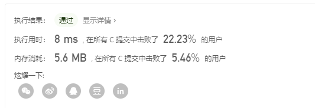

# [20. 有效的括号](https://leetcode-cn.com/problems/valid-parentheses)

给定一个只包括 '('，')'，'{'，'}'，'['，']' 的字符串，判断字符串是否有效。

有效字符串需满足：

- 左括号必须用相同类型的右括号闭合。
- 左括号必须以正确的顺序闭合。
- 注意空字符串可被认为是有效字符串。

示例 1:
```
输入: "()"
输出: true
```
示例 2:
```
输入: "()[]{}"
输出: true
```
示例 3:
```
输入: "(]"
输出: false
```
示例 4:
```
输入: "([)]"
输出: false
```
示例 5:
```
输入: "{[]}"
输出: true
```
通过次数436,161提交次数1,011,015
## 个人见解
很明显，看到这种括号的题，就想起了以前中缀表达式转后缀表达式的过程。  
也就说，很明显就是一个栈能解决的问题..  
不断压栈后，检测到有左右括号，就弹出其中的元素，那么最后的栈一定是空的  

很明显可以用标志位来解决这个问题，即检测到对应的左括号时，将对应的括号标志位置1，再pop出。

先写一个简单的栈
```
typedef struct Stack
{
    int top;
    char *data;
} mystack;
```
因为不知道输入的字符串长度，所以需要动态申请空间
```
mystack *initStack(int leng)
{
    mystack *stack = (mystack *)malloc(sizeof(mystack));
    stack->data = (char *)malloc(sizeof(char) * leng);
    stack->top = 0;
    return stack;
}
```
这些方法都非常熟悉了
```
//覆盖方法，空间其实还没被释放，只是栈顶指针的移动
void pop(mystack *s)
{
    if (s->top > 0)
    {
        s->top--;
        printf("pop ..%c \n", s->data[s->top]);
    }
}
void push(mystack *s, char str)
{

    s->data[s->top] = str;
    printf("push ..%c \n", s->data[s->top]);
    s->top++;
}
char getTop(mystack *s)
{
    if (s->top != 0)
        return s->data[s->top - 1];
    else
    {
        return '0';
    }
}
bool emptyStack(mystack *s)
{
    return (s->top == 0);
}
```
那么这里就是主逻辑，需要将在一起的括号弹出。将标记号置0
```
bool isValid(char *s)
{
    int leng = 0, flag = 0, flag1 = 0, flag2 = 0;
    char cur;
    for (int i = 0; s[i] != '\0'; i++, leng++)
        ;
    mystack *stack = initStack(leng);
    push(stack, s[0]);
    for (int i = 1; i < leng; i++)
    {
        cur = getTop(stack);
        switch (cur)
        {
        case '(':
            flag = 1;
            flag1 = 0;
            flag2 = 0;
            break;

            break;
        case '[':
            flag1 = 1;
            flag = 0;
            flag2 = 0;
            break;

        case '{':
            flag2 = 1;
            flag1 = 0;
            flag = 0;
            break;
        default:
            break;
        }
        push(stack, s[i]);
        switch (s[i])
        {
        case ')':
            if (flag)
            {
                pop(stack);
                pop(stack);
            }
            break;
        case ']':

            if (flag1)
            {
                pop(stack);
                pop(stack);
            } 
            break;
        case '}':
            if (flag2)
            {
                pop(stack);
                pop(stack);
            }
        default:
            break;
        }
        flag2 = 0;
        flag1 = 0;
        flag = 0;
    }
    return emptyStack(stack);
}
```
不过才是这个样子，其实不太满意

  

我们需要改进一下，一堆switch显得过于臃肿，我们要像python的dict一样拿到一个字典。

注意到奇数长度的必然是false，就可以直接干掉一半的字符串  

我们还可以用一个简单的数组来代替stack，就不用这么多鸟事了(来自标准答案)  
```
char pairs(char a)
{
    if (a == '}')
        return '{';
    if (a == ']')
        return '[';
    if (a == ')')
        return '(';
    return 0;
}

bool isValid(char *s)
{
    int leng = 0;
    for (int i = 0; s[i] != '\0'; i++, leng++)
        ;
    if (leng % 2 == 1)
    {
        return 0;
    }
    int *stk=(int *)malloc(sizeof(int)*leng + 1), top = 0;
    for (int i = 0; i < leng; i++)
    {
        char ch = pairs(s[i]);
        //若是出现了 右括号
        if (ch)
        {
            if (top == 0 || stk[top - 1] != ch)
            {
                return 0;
            }
            top--;
        }
        else
        {
            stk[top++] = s[i];
        }
    }
    return top == 0;
}

```

当然在python里是一样的,思路都是一模一样的(来自标准答案)
```
class Solution:
    def isValid(self, s: str) -> bool:
        if len(s) % 2 == 1:
            return False
        
        pairs = {
            ")": "(",
            "]": "[",
            "}": "{",
        }
        stack = list()
        for ch in s:
            if ch in pairs:
                if not stack or stack[-1] != pairs[ch]:
                    return False
                stack.pop()
            else:
                stack.append(ch)
        
        return not stack
```
### 笔迹
先做做笔记，来自
[https://blog.csdn.net/m0_37592397/article/details/79701992](https://blog.csdn.net/m0_37592397/article/details/79701992)
```
char *str1="absde";
char str2[]="absde";
```
> str1是一个指针，只是指向了字符串”absde”而已。所以sizeof(str1)不是字符串占的空间也不是字符数组占的空间，而是一个字符型指针占的空间。所以sizeof(str1)=sizeof(char*)=4，在C/C++中一个指针占4个字节

> str2是一个字符型数组。C/C++规定，对于一个数组，返回这个数组占的总空间，所以sizeof(str2)取得的是字符串”absde”占的总空间。”absde”中，共有a b s d e \0六个字符，所以str2数组的长度是6，所以sizeof(str2)=6*sizeof(char)=6

如果是函数的参数为指针的话,想取到对应的空间也是不能的 

但实际上因为，a是函数参数，到了本函数中，a只是一个指针（地址，系统在本函数运行时，是不知道a所表示的地址有多大的数据存储空间，这里只是告诉函数：一个数据存储空间首地址），所以，sizoef(a)的结果是指针变量a占内存的大小，一般在32位机上是4个字节。a[0]是int类型，sizeof(a[0])也是4个字节，所以，结果永远是1。

**因此，获得数组长度，只能在数组定义所在的代码区中**