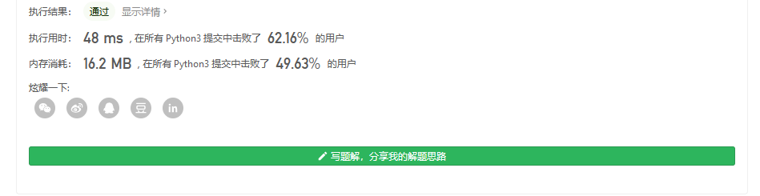

#### [剑指 Offer 06. 从尾到头打印链表](https://leetcode-cn.com/problems/cong-wei-dao-tou-da-yin-lian-biao-lcof/)

输入一个链表的头节点，从尾到头反过来返回每个节点的值（用数组返回）。

 

**示例 1：**

```
输入：head = [1,3,2]
输出：[2,3,1]
```

 

**限制：**

```
0 <= 链表长度 <= 10000
```


很简单,最简单就是反向输出


不过每次都忘了输入检测是什么鬼 哈哈哈


```
class Solution:
    def reversePrint(self, head: ListNode) -> list[int]:
        if not head:
            return []
        vals=[]
        temp=head
        while temp.next:
            vals.append(temp.val)
            temp=temp.next
        vals.append(temp.val)
        return vals[::-1]
```

