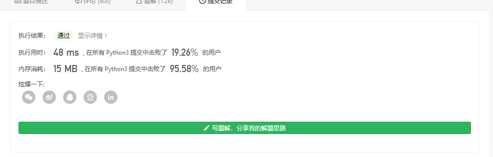
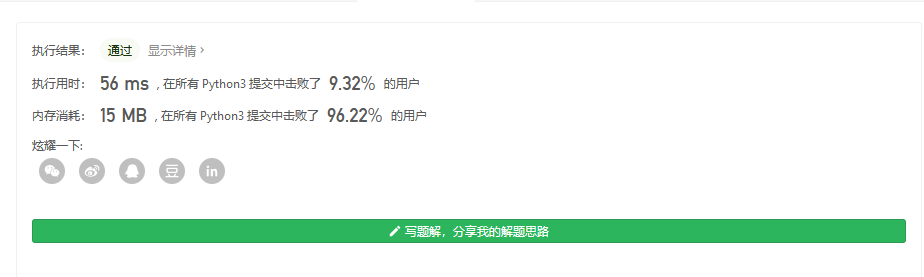

#### [剑指 Offer 11. 旋转数组的最小数字](https://leetcode-cn.com/problems/xuan-zhuan-shu-zu-de-zui-xiao-shu-zi-lcof/)

把一个数组最开始的若干个元素搬到数组的末尾，我们称之为数组的旋转。输入一个递增排序的数组的一个旋转，输出旋转数组的最小元素。例如，数组 `[3,4,5,1,2]` 为 `[1,2,3,4,5]` 的一个旋转，该数组的最小值为1。 

**示例 1：**

```
输入：[3,4,5,1,2]
输出：1
```

**示例 2：**

```
输入：[2,2,2,0,1]
输出：0
```

注意：本题与主站 154 题相同：https://leetcode-cn.com/problems/find-minimum-in-rotated-sorted-array-ii/


我们随手写一个二分

```

class Solution:
    def minArray(self, numbers: List[int]) -> int:
        low, high = 0, len(numbers) - 1
        while low < high:
            mid = low + (high - low) // 2 #防止 越界
            if numbers[mid] < numbers[high]:
                high = mid
            elif numbers[mid] > numbers[high]:
                low = mid + 1
            else:
                high -= 1
        return numbers[low]

```



或者..

```

class Solution:
    def minArray(self, numbers: List[int]) -> int:
        return min(numbers)

```

