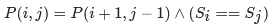
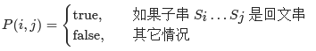
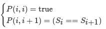

#### [5. Longest Palindromic Substring](https://leetcode-cn.com/problems/longest-palindromic-substring/)

Given a string `s`, return *the longest palindromic substring* in `s`.

 

**Example 1:**

```
Input: s = "babad"
Output: "bab"
Note: "aba" is also a valid answer.
```

**Example 2:**

```
Input: s = "cbbd"
Output: "bb"
```

**Example 3:**

```
Input: s = "a"
Output: "a"
```

**Example 4:**

```
Input: s = "ac"
Output: "a"
```

 

**Constraints:**

- `1 <= s.length <= 1000`
- `s` consist of only digits and English letters (lower-case and/or upper-case),


看起来有些思路，但迟迟下不了笔，这该怎么办？


## 暴力法

直接列出所有可能，首先来复习一下动态规划

1. 建立状态转移方程
2. 缓存并复用以往结果
3. 按顺序从小往大算

> https://leetcode-cn.com/problems/longest-palindromic-substring/solution/zui-chang-hui-wen-zi-chuan-by-leetcode-solution/

这里的状态转移方程是什么？是指 大问题的最优解由小问题的最优解组成的，所以我们观察得到

只要一个回文字符串 两边加上一个相同的字符，那么这个新的字符串也是回文的

比如

'a' 的两边加上‘b'

即 'aba' 是回文的

然后 'cabac' 也是回文的

根据这样的思路，容易知道 我们需要遍历所有的字符串子串 

然后我们需要列一个很多的数组来代表 这个字符串是不是回文的

 那么我们就可以写出动态规划的状态转移方程： 



其中

我们用 P(i,j)P(i,j)P(i,j) 表示字符串 sss 的第 iii 到 jjj 个字母组成的串（下文表示成 s[i:j]s[i:j]s[i:j]）是否为回文串：



那么现在已经列出来了 注意到有特殊情况 边界的时候



我们还需要考虑动态规划中的边界条件，即子串的长度为 111 或 222。对于长度为 111 的子串，它显然是个回文串；对于长度为 222 的子串，只要它的两个字母相同，它就是一个回文串。因此我们就可以写出动态规划的边界条件：


根据这个思路，我们就可以完成动态规划了，最终的答案即为所有 P(i,j)=trueP(i, j) = \text{true}P(i,j)=true 中 j−i+1j-i+1j−i+1（即子串长度）的最大值。


注意：在状态转移方程中，我们是从长度较短的字符串向长度较长的字符串进行转移的，因此一定要注意动态规划的循环顺序。

```
class Solution:
    def longestPalindrome(self, s: str) -> str:
        n = len(s)
        dp = [[False] * n for _ in range(n)]
        ans = ""
        # 枚举子串的长度 l+1
        for l in range(n):
            # 枚举子串的起始位置 i，这样可以通过 j=i+l 得到子串的结束位置
            for i in range(n):
                j = i + l
                # print(s[i:j]) s[i:j]就是所有的子串
                if j >= len(s): # 当 子串的长度大于等于s的长度时 也就是说 子串尾指针 到头了 直接break
                    break
                if l == 0: # 第一个字符作为子串 肯定是 回文
                    dp[i][j] = True
                elif l == 1: # 子串长度为2 作为回文，那肯定是两个相等才是回文的
                    dp[i][j] = (s[i] == s[j])
                else: #如果子串长度为>2 那么就要穷举逐个判断了
                    dp[i][j] = (dp[i + 1][j - 1] and s[i] == s[j])
                if dp[i][j] and l + 1 > len(ans): # 如果第 i 到 j的 子串是回文并且 长度比之前的子串长的话
                    ans = s[i:j + 1]
        return ans
```


真失败，看着官方的题解发了好久呆 才知道大概什么意思


