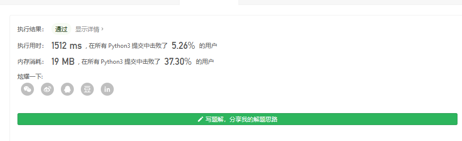

#### [713. Subarray Product Less Than K](https://leetcode-cn.com/problems/subarray-product-less-than-k/)

Your are given an array of positive integers `nums`.

Count and print the number of (contiguous) subarrays where the product of all the elements in the subarray is less than `k`.

**Example 1:**
 

```
Input: nums = [10, 5, 2, 6], k = 100
Output: 8
Explanation: The 8 subarrays that have product less than 100 are: [10], [5], [2], [6], [10, 5], [5, 2], [2, 6], [5, 2, 6].
Note that [10, 5, 2] is not included as the product of 100 is not strictly less than k.
```


**Note:** 

`0 < nums.length <= 50000`.

`0 < nums[i] < 1000`.

`0 <= k < 10^6`.

```
class Solution(object):
    def numSubarrayProductLessThanK(self, nums, k):
        if k <= 1:
            return 0
        mul = 1
        res = 0
        left = 0
        for right, val in enumerate(nums):
            mul *= val
            while mul >= k:
                mul /= nums[left]
                left += 1
            res += right - left + 1
        return res

```

双指针非常轻松

