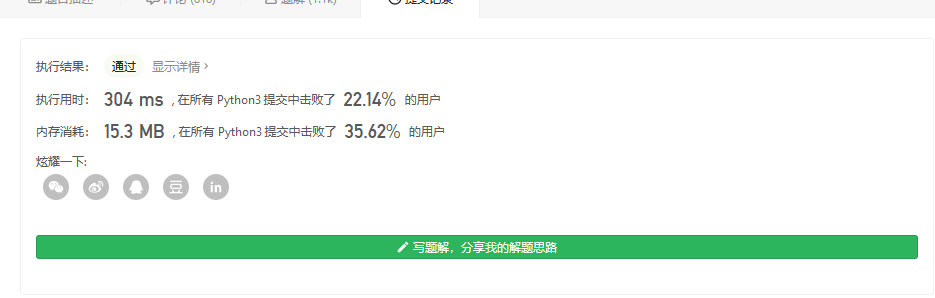

#### [47. 全排列 II](https://leetcode-cn.com/problems/permutations-ii/)

给定一个可包含重复数字的序列 `nums` ，**按任意顺序** 返回所有不重复的全排列。

 

**示例 1：**

```
输入：nums = [1,1,2]
输出：
[[1,1,2],
 [1,2,1],
 [2,1,1]]
```

**示例 2：**

```
输入：nums = [1,2,3]
输出：[[1,2,3],[1,3,2],[2,1,3],[2,3,1],[3,1,2],[3,2,1]]
```

 

**提示：**

- `1 <= nums.length <= 8`
- `-10 <= nums[i] <= 10`

不重复的,加入集合就好

```
class Solution:
    def permuteUnique(self, nums: List[int]) -> List[List[int]]:
        ans=set()
        def dfs(start):
            if start==len(nums):
                ans.add(tuple(nums.copy()))
                return
            for i in range(start,len(nums)):
                nums[i],nums[start]=nums[start],nums[i]
                dfs(start+1)
                nums[i],nums[start]=nums[start],nums[i]
        dfs(0)
        return list(ans)
```



或者可以正统的直接枚举

```
class Solution:
    def permute(self, nums):
        """
        :type nums: List[int]
        :rtype: List[List[int]]
        """
        def backtrack(first = 0):
            # 所有数都填完了
            if first == n:  
                res.append(nums[:])
            for i in range(first, n):
                # 动态维护数组
                nums[first], nums[i] = nums[i], nums[first]
                # 继续递归填下一个数
                backtrack(first + 1)
                # 撤销操作
                nums[first], nums[i] = nums[i], nums[first]
        
        n = len(nums)
        res = []
        backtrack()
        return res


作者：LeetCode-Solution
链接：https://leetcode-cn.com/problems/permutations/solution/quan-pai-lie-by-leetcode-solution-2/
来源：力扣（LeetCode）
著作权归作者所有。商业转载请联系作者获得授权，非商业转载请注明出处。
```

当然可以不用集合,那就是提前判断

```
from typing import List


class Solution:

    def permuteUnique(self, nums: List[int]) -> List[List[int]]:

        def dfs(nums, size, depth, path, used, res):
            if depth == size:
                res.append(path.copy())
                return
            for i in range(size):
                if not used[i]:

                    if i > 0 and nums[i] == nums[i - 1] and not used[i - 1]:
                        continue

                    used[i] = True
                    path.append(nums[i])
                    dfs(nums, size, depth + 1, path, used, res)
                    used[i] = False
                    path.pop()

        size = len(nums)
        if size == 0:
            return []

        nums.sort()

        used = [False] * len(nums)
        res = []
        dfs(nums, size, 0, [], used, res)
        return res


作者：liweiwei1419
链接：https://leetcode-cn.com/problems/permutations-ii/solution/hui-su-suan-fa-python-dai-ma-java-dai-ma-by-liwe-2/
来源：力扣（LeetCode）
著作权归作者所有。商业转载请联系作者获得授权，非商业转载请注明出处。
```

