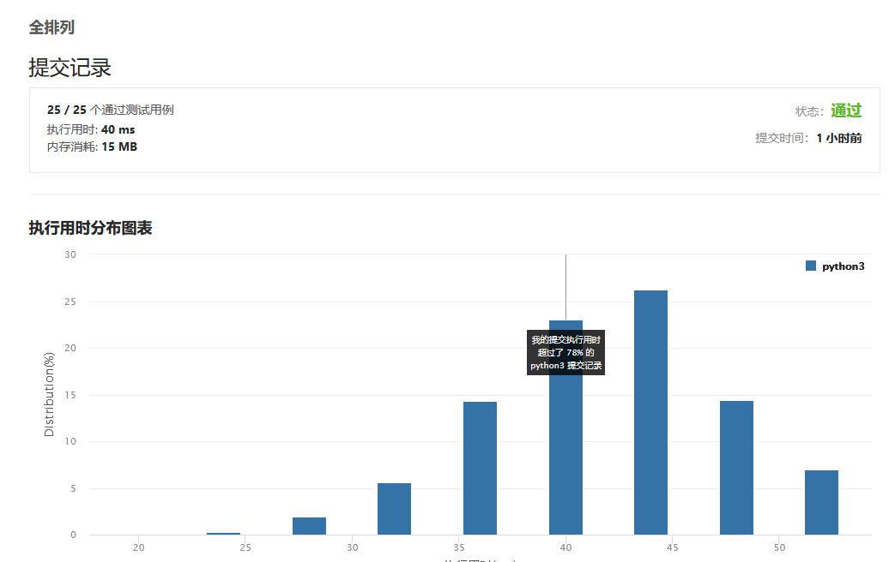

#### [46. 全排列](https://leetcode-cn.com/problems/permutations/)

给定一个 **没有重复** 数字的序列，返回其所有可能的全排列。

**示例:**

```
输入: [1,2,3]
输出:
[
  [1,2,3],
  [1,3,2],
  [2,1,3],
  [2,3,1],
  [3,1,2],
  [3,2,1]
]


```

注意到规律是从第一个开始 逐渐向后交换,注意要换回来 (实际上是回溯的思想)

递归实现

```
class Solution:
    def permute(self, nums: List[int]) -> List[List[int]]:
        ans=[]
        def dfs(start):
            if start==len(nums):
                ans.append(nums.copy())
                return
            for i in range(start,len(nums)):
                nums[i],nums[start]=nums[start],nums[i]
                dfs(start+1)
                nums[i],nums[start]=nums[start],nums[i]
        dfs(0)
        return ans
```



或者用正统的枚举

```
class Solution:
    def permute(self, nums: List[int]) -> List[List[int]]:
        res = []
        def backtrack(nums, tmp):
            if not nums:
                res.append(tmp)
                return 
            for i in range(len(nums)):
                backtrack(nums[:i] + nums[i+1:], tmp + [nums[i]])
        backtrack(nums, [])
        return res


作者：powcai
链接：https://leetcode-cn.com/problems/permutations/solution/hui-su-suan-fa-by-powcai-2/
来源：力扣（LeetCode）
著作权归作者所有。商业转载请联系作者获得授权，非商业转载请注明出处。
```

