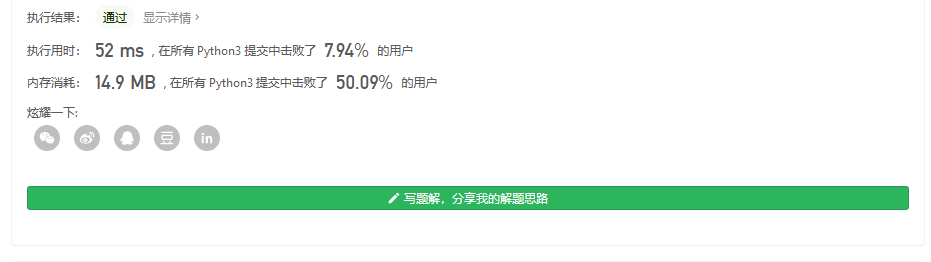

#### [剑指 Offer 16. 数值的整数次方](https://leetcode-cn.com/problems/shu-zhi-de-zheng-shu-ci-fang-lcof/)

实现 [pow(*x*, *n*)](https://www.cplusplus.com/reference/valarray/pow/) ，即计算 x 的 n 次幂函数（即，xn）。不得使用库函数，同时不需要考虑大数问题。

 

**示例 1：**

```
输入：x = 2.00000, n = 10
输出：1024.00000
```

**示例 2：**

```
输入：x = 2.10000, n = 3
输出：9.26100
```

**示例 3：**

```
输入：x = 2.00000, n = -2
输出：0.25000
解释：2-2 = 1/22 = 1/4 = 0.25
```

 

**提示：**

- `-100.0 < x < 100.0`
- `-231 <= n <= 231-1`
- `-104 <= xn <= 104`


不需要考虑大数问题,那么直接快速幂一下

注意到输入的 n 有正负 或者是0 所以记得判断一下 还要记得不要让n是负的 不然无限循环了

```
class Solution:
    def myPow(self, x: float, n: int) -> float:
        turn=False
        if n<0:
            turn=True
            n=-n
        if 0<=x<=0.000001:
            return 0
        res=1
        while n:
            if n&1:
                res*=x
            x*=x
            n=n>>1

        return 1/res if turn else res
```

