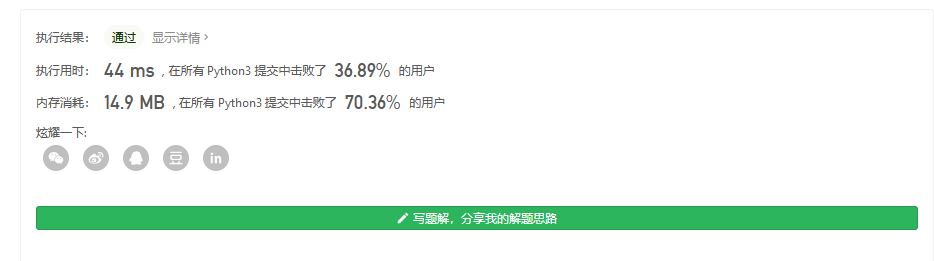

#### [78. 子集](https://leetcode-cn.com/problems/subsets/)

给你一个整数数组 `nums` ，数组中的元素 **互不相同** 。返回该数组所有可能的子集（幂集）。

解集 **不能** 包含重复的子集。你可以按 **任意顺序** 返回解集。

 

**示例 1：**

```
输入：nums = [1,2,3]
输出：[[],[1],[2],[1,2],[3],[1,3],[2,3],[1,2,3]]
```

**示例 2：**

```
输入：nums = [0]
输出：[[],[0]]
```

 

**提示：**

- `1 <= nums.length <= 10`
- `-10 <= nums[i] <= 10`
- `nums` 中的所有元素 **互不相同**

值得一提的是 python有调库的做法

```
import itertools
from typing import List


class Solution:
    def subsets(self, nums: List[int]) -> List[List[int]]:
        res = []
        for i in range(len(nums)+1):
            for tmp in itertools.combinations(nums, i):
                res.append(tmp)
        return res

Solution().subsets([1,2,3])

```



那么接着就是正统的回溯了

```
import itertools
from typing import List


class Solution:
    def subsets(self, nums: List[int]) -> List[List[int]]:
        res = []
        def dfs(begin,path):
            res.append(path[:])
            if begin==len(nums):
                return
            for i in range(begin,len(nums)):
                path.append(nums[i])
                dfs(i+1,path)
                path.pop(-1)
        dfs(0,[])
        print(res)

Solution().subsets([1,2,3])

```

或者写成这样

```
class Solution:
    def subsets(self, nums: List[int]) -> List[List[int]]:
        res = []
        n = len(nums)
        
        def helper(i, tmp):
            res.append(tmp)
            for j in range(i, n):
                helper(j + 1,tmp + [nums[j]] )
        helper(0, [])
        return res  


作者：powcai
链接：https://leetcode-cn.com/problems/subsets/solution/hui-su-suan-fa-by-powcai-5/
来源：力扣（LeetCode）
著作权归作者所有。商业转载请联系作者获得授权，非商业转载请注明出处。
```

